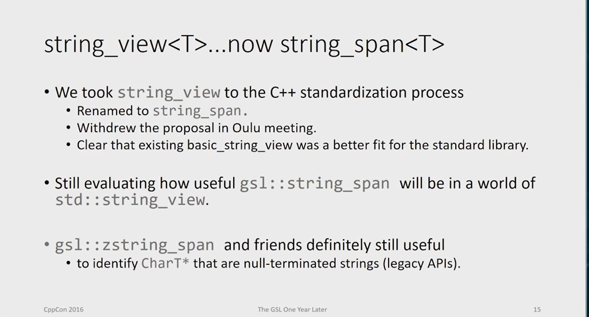

# Guideline Support Library

# link
* [microsoft-GSL](https://github.com/microsoft/GSL)
* [c-core-guideline-the-guidelines-support-library](https://www.modernescpp.com/index.php/c-core-guideline-the-guidelines-support-library/)
* [CppCoreGuidelines](https://isocpp.github.io/CppCoreGuidelines/CppCoreGuidelines#gsl-guidelines-support-library)
* [cpp-core-guidelines-docs.vercel.app](https://cpp-core-guidelines-docs.vercel.app/gsl)

# gsl::owner<T*>
`gsl::owner<T*>` is a utility provided by the [Guidelines Support Library (GSL)](https://github.com/microsoft/GSL), a library that implements some of the C++ Core Guidelines. The primary purpose of `gsl::owner` is to explicitly indicate ownership of a raw pointer in the code. This helps improve code readability and conveys intent, making it clear when a function or class is responsible for managing the lifetime of a pointer.

Here’s a breakdown:

- **`gsl::owner<T*>`**: Used to annotate a raw pointer to indicate that the code is responsible for managing its lifetime (e.g., allocating and deallocating memory for it).
- This is purely an annotation and does not affect runtime behavior. However, tools like static analyzers can use this information to identify potential issues, such as memory leaks or dangling pointers.

### Example 1: Without `gsl::owner`
```cpp
#include <iostream>

void deletePointer(int* ptr) {
    delete ptr; // The caller must ensure proper ownership transfer
}

int main() {
    int* data = new int(42);
    deletePointer(data); // It's unclear who owns `data`
    return 0;
}
```
The code above does not make ownership of the pointer explicit. `data` is allocated with `new`, but it’s unclear who is responsible for deleting it. This can lead to confusion or bugs.

---

### Example 2: With `gsl::owner`
```cpp
#include <gsl/gsl>

void deletePointer(gsl::owner<int*> ptr) {
    delete ptr; // It's now clear this function takes ownership
}

int main() {
    gsl::owner<int*> data = new int(42); // Ownership is explicit
    deletePointer(data);                 // Ownership transferred
    return 0;
}
```
In this version, using `gsl::owner` makes it explicit that:
1. `data` is owned and needs to be deleted at some point.
2. The `deletePointer` function takes ownership of the pointer.

---

### Example 3: Returning Ownership
When a function allocates memory and returns a pointer, `gsl::owner` can make it clear that the caller is now responsible for the resource.

```cpp
#include <gsl/gsl>

gsl::owner<int*> createInteger() {
    return new int(100); // Explicitly marks that ownership is being returned
}

int main() {
    gsl::owner<int*> num = createInteger();
    std::cout << *num << '\n';
    delete num; // Caller is responsible for deleting the allocated memory
    return 0;
}
```

---

### Example 4: Mixing with Smart Pointers
`gsl::owner` is not a replacement for smart pointers (`std::unique_ptr` or `std::shared_ptr`), but it can be useful when working with raw pointers for legacy code or performance reasons.

```cpp
#include <gsl/gsl>
#include <memory>

void transferOwnership(gsl::owner<int*> ptr) {
    delete ptr;
}

int main() {
    // Explicit ownership with gsl::owner
    gsl::owner<int*> rawPtr = new int(200);

    // Converting to a smart pointer
    std::unique_ptr<int> smartPtr(rawPtr); // Smart pointer now owns the memory

    // transferOwnership(rawPtr); // Error: rawPtr is now managed by smartPtr
    return 0;
}
```
This example highlights that once ownership is transferred to a smart pointer, you should not use the raw pointer elsewhere.

---

### Key Takeaways:
1. **Intent**: `gsl::owner` is a documentation tool that improves code clarity.
2. **Static Analysis**: Tools like Clang-Tidy can detect ownership-related issues using `gsl::owner`.
3. **Raw Pointers**: Use `gsl::owner` with raw pointers when smart pointers (e.g., `std::unique_ptr`) are not an option.
4. **Runtime Behavior**: `gsl::owner` does not change runtime behavior—it’s purely a compile-time annotation.

When possible, prefer smart pointers for automatic memory management. Use `gsl::owner` in cases where you must work with raw pointers but want to make ownership intentions explicit.

# Expects() and Ensures()
`Expects()` and `Ensures()` are part of the **Guidelines Support Library (GSL)**, designed to help you write safer, more self-documenting code. They are used for **contract programming** by defining **preconditions** (`Expects`) and **postconditions** (`Ensures`) for functions.

---

### What is `Expects()`?
`Expects()` is used to define a **precondition** for a function. A **precondition** is a condition that must be true when the function is called. If the precondition is violated, the behavior of the function is undefined, and `Expects()` signals this error.

#### Syntax:
```cpp
void Expects(bool condition);
```

#### Example:
```cpp
#include <gsl/gsl>

void divide(int a, int b) {
    Expects(b != 0); // Precondition: denominator must not be zero
    int result = a / b;
}
```
In this example:
- The function assumes `b` is not zero.
- If `b == 0`, `Expects()` will terminate the program (or invoke custom error handling based on the GSL implementation).

---

### What is `Ensures()`?
`Ensures()` is used to define a **postcondition** for a function. A **postcondition** is a condition that must be true when the function finishes execution. It helps ensure the function behaves as intended after completing its task.

#### Syntax:
```cpp
void Ensures(bool condition);
```

#### Example:
```cpp
#include <gsl/gsl>

int increment(int x) {
    int result = x + 1;
    Ensures(result > x); // Postcondition: result must be greater than input
    return result;
}
```
In this example:
- The function guarantees that the returned value will always be greater than the input.
- If the postcondition is violated, `Ensures()` will terminate the program.

---

### Difference Between `Expects()` and `Ensures()`
| **Aspect**       | **Expects()**                          | **Ensures()**                          |
|-------------------|----------------------------------------|----------------------------------------|
| **Purpose**       | Defines **preconditions** (what must be true before a function runs). | Defines **postconditions** (what must be true after a function runs). |
| **Timing**        | Checked **before** the function executes. | Checked **after** the function executes. |
| **Use Case**      | Used to ensure valid inputs to a function. | Used to ensure the function's output or state is as expected. |
| **When It Runs**  | At the start of the function.          | At the end of the function.            |

---

### Full Example
```cpp
#include <gsl/gsl>
#include <vector>
#include <iostream>

int getValueAt(const std::vector<int>& v, size_t index) {
    Expects(index < v.size()); // Precondition: index must be valid
    int value = v[index];
    Ensures(value >= 0); // Postcondition: value must be non-negative
    return value;
}

int main() {
    std::vector<int> numbers = {10, 20, 30};
    
    // Valid call
    std::cout << getValueAt(numbers, 1) << '\n'; // Output: 20
    
    // Invalid precondition
    // getValueAt(numbers, 5); // Terminates: Precondition violated
    
    return 0;
}
```

---

### How `Expects()` and `Ensures()` Work
- By default, they call `std::terminate()` if the condition is violated.
- They serve as **documentation** for readers and allow **static analysis tools** to identify contract violations during compilation or runtime.

---

### Key Takeaways:
1. **`Expects()`** ensures the function is called correctly with valid arguments.
2. **`Ensures()`** guarantees the function produces valid results and satisfies its intended behavior.
3. **Static Analysis**: Modern compilers and static analysis tools can validate contracts and catch violations early.
4. **Runtime Behavior**: Violations terminate the program unless you configure a custom handler. 

Together, they help make code more robust, self-explanatory, and easier to debug!

# gsl::span
In the **Guideline Support Library (GSL)** for C++, `gsl::span` is a lightweight, non-owning view of an array or contiguous sequence of elements. It allows safe access to elements in an array or container without the need for copying or managing ownership. This is particularly useful when you want to pass a "view" of a sequence to a function without transferring ownership.

`gsl::view` is sometimes referred to as a concept rather than a specific type. In this context, a **view** represents a way of accessing or interacting with data without copying it. The primary implementation in GSL is `gsl::span`.

---

### **Key Features of gsl::span**
1. **Non-owning**: It does not manage the lifetime of the underlying data.
2. **Contiguous sequence**: Works with arrays, `std::vector`, or other containers that store data contiguously in memory.
3. **Bounds-safe**: Provides access with bounds checking (when compiled with `GSL_THROW_ON_CONTRACT_VIOLATION`).

---

### **Syntax**
```cpp
#include <gsl/gsl>

gsl::span<T> view;
```

- `T`: Type of elements in the span (can be `const` for read-only views).

---

### **Example: Basic Usage of gsl::span**

Here’s an example of how to use `gsl::span` as a view:

```cpp
#include <iostream>
#include <vector>
#include <gsl/gsl>

void print_span(gsl::span<const int> data) {
    for (auto value : data) {
        std::cout << value << " ";
    }
    std::cout << std::endl;
}

int main() {
    // Example 1: Using a C-style array
    int arr[] = {1, 2, 3, 4, 5};
    gsl::span<int> span_from_array(arr);  // Create a view over the array
    print_span(span_from_array);

    // Example 2: Using std::vector
    std::vector<int> vec = {10, 20, 30, 40, 50};
    gsl::span<int> span_from_vector(vec);  // Create a view over the vector
    print_span(span_from_vector);

    // Example 3: Using part of a vector
    gsl::span<int> span_subvector(vec.data() + 1, 3);  // A subrange view
    print_span(span_subvector);

    return 0;
}
```

---

### **Explanation of the Code**
1. **C-style Array**:
   - `span_from_array` creates a view over the array `arr` without copying it.
2. **std::vector**:
   - `span_from_vector` creates a view over the vector `vec`. Any modification to the vector reflects in the span, as it directly references the same memory.
3. **Subrange**:
   - You can specify a subrange of data for the span by passing a pointer and size (e.g., `vec.data() + 1, 3` views `vec[1]` to `vec[3]`).

---

### **Key Notes**
- `gsl::span` ensures **type safety** and helps avoid dangling pointers.
- It is useful for functions where you don't want to specify a particular container type (like `std::vector` or arrays), ensuring flexibility.
- Bounds checking is performed in debug builds to ensure safety.

---

### **When to Use gsl::span?**
1. When passing subranges of data to functions.
2. To avoid unnecessary copying of large datasets.
3. When working with raw arrays in a safer way.
4. To make code container-agnostic, so it works with arrays, vectors, etc.

This simplifies programming, ensures bounds safety, and improves performance when managing large datasets.


---------------------------------------------------------------------------------------------


## What is `gsl::owner<T>`?

`gsl::owner<T>` is a marker type from the Microsoft's Guidelines Support Library (GSL) that indicates ownership of a dynamically allocated object. It's used to make raw pointer ownership explicit in code, helping to prevent memory leaks and clarify resource management.

## Why use `gsl::owner<T>`?

1. **Makes ownership explicit**: Clearly shows which pointers own their resources
2. **Helps static analysis tools**: Makes it easier for tools to detect memory leaks
3. **Documents code intent**: Makes it obvious which pointers are responsible for deletion
4. **Transition to smart pointers**: Helps when migrating from raw pointers to smart pointers

## Common problems it solves:

1. **Unclear ownership**: When it's not obvious who should delete a pointer
2. **Memory leaks**: When ownership isn't properly transferred
3. **Double deletions**: When ownership isn't tracked properly

## Examples

### Basic Usage
```cpp
#include <gsl/gsl>

void basic_example() {
    gsl::owner<int*> ptr = new int(42);  // Clearly shows ownership
    
    // ... use ptr ...
    
    delete ptr;  // Ownership makes it clear we should delete here
}
```

### Without gsl::owner (problematic)
```cpp
void problematic_example() {
    int* ptr1 = new int(10);
    int* ptr2 = ptr1;  // Who owns this? Should it be deleted?
    
    // ... code ...
    
    // Should we delete ptr1? ptr2? Both? Neither?
}
```

### With gsl::owner (clear ownership)
```cpp
void clear_example() {
    gsl::owner<int*> ptr1 = new int(10);
    int* ptr2 = ptr1;  // Non-owner pointer - just borrowing
    
    // ... code ...
    
    delete ptr1;  // Clear that ptr1 is the owner
    // ptr2 must not be deleted
}
```

### In class members
```cpp
class ResourceHolder {
    gsl::owner<Resource*> resource_;  // Clearly this class owns the resource
    
public:
    ResourceHolder() : resource_(new Resource()) {}
    
    ~ResourceHolder() {
        delete resource_;  // Clear we need to clean up
    }
    
    // Prevent copying (or implement proper ownership transfer)
    ResourceHolder(const ResourceHolder&) = delete;
    ResourceHolder& operator=(const ResourceHolder&) = delete;
};
```

### Transferring ownership
```cpp
gsl::owner<Data*> create_data() {
    return gsl::owner<Data*>(new Data());  // Transfer ownership to caller
}

void consume_data() {
    gsl::owner<Data*> data = create_data();
    // ... use data ...
    delete data;  // We're now responsible
}
```

### In legacy code migration
```cpp
void migrate_legacy_code() {
    // Old code:
    // char* buffer = malloc(1024);
    
    // Migrating to be more explicit:
    gsl::owner<char*> buffer = malloc(1024);
    
    // ... use buffer ...
    
    free(buffer);  // Clear we own this memory
}
```

## When to use gsl::owner<T>

1. When working with legacy code that uses raw pointers
2. When smart pointers can't be used (e.g., in embedded systems)
3. During code migration to smart pointers
4. When interfacing with C APIs that return owned pointers

## Best Practices

1. Prefer smart pointers (`std::unique_ptr`, `std::shared_ptr`) over `gsl::owner` when possible
2. Use `gsl::owner` as a stepping stone when migrating from raw pointers to smart pointers
3. Always pair `gsl::owner` with proper cleanup (delete/free)
4. Document ownership transfers clearly

Remember that `gsl::owner` is just a marker - it doesn't automatically manage memory like smart pointers do. It's a tool to make your intentions clearer and help catch errors.


# Understanding `gsl::owner<T>` - Simple Explanation

## What is Ownership?

Ownership means **responsibility for deleting/freeing memory**. When you create an object with `new` (in C++), someone needs to call `delete` later. That "someone" is the *owner*.

## The Problem Without `gsl::owner`

```cpp
int* createNumber() {
    int* num = new int(42);  // Who will delete this?
    return num;
}

void useNumber() {
    int* myNum = createNumber();
    // ... use myNum ...
    // Did I need to delete it? Not clear!
}
```

Without ownership marking:
- It's unclear who should delete the memory
- Easy to forget to delete (memory leak)
- Easy to delete twice (crash)
- Hard to track in large codebases

## How `gsl::owner<T>` Helps

It's like putting a "THIS POINTER OWNS MEMORY" sign on a pointer:

```cpp
#include <gsl/gsl>

gsl::owner<int*> createNumber() {
    gsl::owner<int*> num = new int(42);  // Clear this creates ownership
    return num;  // Transfer ownership to caller
}

void useNumber() {
    gsl::owner<int*> myNum = createNumber();  // I now own this
    // ... use myNum ...
    delete myNum;  // Clear I must delete it
}
```

## Key Points:

1. **It's just documentation** - Doesn't do anything automatically
2. **Makes code intentions clear** - Like comments that tools can check
3. **Helps avoid mistakes** - Like forgetting to delete owned memory

## When You Need It:

1. **Working with raw pointers** (instead of smart pointers)
2. **Legacy code** that can't use modern C++ features
3. **Performance-critical code** where smart pointers add overhead
4. **Interfacing with C code** that returns raw pointers

## Real-World Analogy

Think of it like a rental car agreement:
- Regular pointer (`int*`): Just borrowing the car (someone else handles return)
- `gsl::owner<int*>`: You signed the rental agreement (you must return it)

## Should You Use It?

- **Prefer smart pointers** (`unique_ptr`, `shared_ptr`) in new code
- Use `gsl::owner` when:
  - You can't use smart pointers
  - You're transitioning old code to be safer
  - You need to document ownership clearly

Remember: `gsl::owner` is like training wheels - it helps you write safer code until you can use proper smart pointers everywhere.

# Modern C++ Alternatives to `gsl::dyn_array<T>`

Since C++20, several standard library features have been introduced that provide similar functionality to `gsl::dyn_array`. Here's a detailed comparison of alternatives:

## 1. `std::span<T>` (C++20) - For Non-Owning Views

**Best for:** Read-only or read-write views of existing arrays/containers

```cpp
#include <span>
#include <vector>
#include <array>

void span_example() {
    // From C-array
    int raw_array[5] = {1, 2, 3, 4, 5};
    std::span<int> sp1(raw_array);  // Read-write view
    
    // From vector
    std::vector<int> vec = {1, 2, 3};
    std::span<int> sp2(vec);  // View that reflects vector changes
    
    // From array
    std::array<int, 4> std_arr = {1, 2, 3, 4};
    std::span<int> sp3(std_arr);
    
    // Modifying through span
    sp1[0] = 10;  // Modifies raw_array
    sp2[1] = 20;  // Modifies vec
    
    // Bounds-checked access (when compiled with _GLIBCXX_ASSERTIONS)
    // sp1[5] = 6;  // Would throw std::terminate in debug mode
}
```

**Key differences from `gsl::dyn_array`:**
- Always non-owning
- Lighter weight (just a pointer + size)
- No allocation capability
- Better standard library integration

## 2. `std::vector<T>` with `reserve()` - For Owning Dynamic Arrays

**Best for:** Cases where you need an owning, resizable container

```cpp
#include <vector>

void vector_example() {
    // Create with fixed capacity (like dyn_array)
    std::vector<int> vec;
    vec.reserve(10);  // Allocate for 10 elements (no construction)
    
    // Add elements (no reallocation until >10 elements)
    for (int i = 0; i < 10; ++i) {
        vec.push_back(i*2);
    }
    
    // Can still grow if needed (unlike dyn_array)
    vec.push_back(20);  // May reallocate
    
    // Bounds-checked access with at()
    try {
        vec.at(20) = 5;  // Throws std::out_of_range
    } catch (const std::out_of_range& e) {
        // Handle error
    }
}
```

**Key advantages:**
- Automatic memory management
- Can grow as needed
- More functionality (insertion, erasure, etc.)
- Better standard library integration

## 3. `std::array<T, N>` - For Fixed-Size Arrays

**Best for:** Compile-time known fixed sizes

```cpp
#include <array>

void array_example() {
    // Fixed-size array (size known at compile time)
    std::array<int, 5> arr = {1, 2, 3, 4, 5};
    
    // Bounds-checked access
    try {
        arr.at(5) = 6;  // Throws std::out_of_range
    } catch (...) { /* handle */ }
    
    // Always owns its storage
    // Size never changes
}
```

## 4. `std::mdspan` (C++23) - For Multidimensional Views

**Best for:** Multidimensional array views

```cpp
// Requires C++23 compiler support
#include <mdspan>

void mdspan_example() {
    int data[2][3] = {{1,2,3}, {4,5,6}};
    std::mdspan<int, std::extents<size_t, 2, 3>> mat(data);
    
    // Access elements
    std::cout << mat[1, 2];  // 6
}
```

## Choosing the Right Alternative

| Use Case                      | Pre-C++20        | C++20+           |
|-------------------------------|------------------|------------------|
| Non-owning view               | `gsl::dyn_array` | `std::span`      |
| Owning fixed-capacity         | `gsl::dyn_array` | `vector.reserve()`|
| Compile-time fixed size       | `std::array`     | `std::array`     |
| Multidimensional view         | -                | `std::mdspan`    |
| Bounds-checked access         | `gsl::dyn_array` | `.at()` or spans |

## Migration Example

**Original GSL code:**
```cpp
void process_data(gsl::dyn_array<int> data) {
    for (auto& x : data) {
        x *= 2;
    }
}
```

**Modern C++ alternatives:**

1. If you need a modifiable view:
```cpp
void process_data(std::span<int> data) {
    for (auto& x : data) {
        x *= 2;
    }
}
```

2. If you need an owning container:
```cpp
void process_data(std::vector<int>& data) {
    for (auto& x : data) {
        x *= 2;
    }
}
```

3. If size is known at compile time:
```cpp
template <size_t N>
void process_data(std::array<int, N>& data) {
    for (auto& x : data) {
        x *= 2;
    }
}
```

The modern alternatives provide better integration with the standard library, more consistent behavior across implementations, and often better performance characteristics.


# Understanding `gsl::string_span` and Modern Alternatives

## What is `gsl::string_span`?

`gsl::string_span` is a type from the Guidelines Support Library (GSL) that provides a bounds-safe view over character sequences (strings). It's essentially a specialization of `gsl::span` for working with text data.

## Key Features

1. **Non-owning view** - Doesn't manage memory
2. **Bounds-safe access** - Prevents buffer overflows
3. **Interoperability** - Works with C-style strings and `std::string`
4. **Character type awareness** - Has `string_span` (char), `wstring_span` (wchar_t), etc.

## When to Use It

Use `gsl::string_span` when you need:
- Safe string parameter passing
- To work with both C-style strings and `std::string` uniformly
- To prevent buffer overflows in string operations
- To document that a function doesn't take ownership of string data

## Problems It Solves

1. **Buffer overflows** - Prevents out-of-bounds access
2. **Ownership ambiguity** - Clearly shows non-owning semantics
3. **Interface flexibility** - Works with different string types
4. **Null-termination safety** - Can verify null-termination

## Examples

### Basic Usage
```cpp
#include <gsl/gsl>
#include <iostream>
#include <string>

void print_string(gsl::string_span str) {
    // Safe access
    for (auto ch : str) {
        std::cout << ch;
    }
    std::cout << '\n';
    
    // Bounds-checked access
    if (!str.empty()) {
        std::cout << "First char: " << str[0] << '\n';
        // std::cout << str[str.length()]; // Would throw gsl::fail_fast
    }
}

int main() {
    // From C-style string
    const char* cstr = "Hello";
    print_string(cstr);
    
    // From std::string
    std::string stdstr = "World";
    print_string(gsl::string_span(stdstr));
    
    // From array
    char arr[] = "Array";
    print_string(arr);
}
```

### Ensuring Null-Termination
```cpp
void process_null_terminated(gsl::czstring_span str) {
    // czstring_span guarantees null-termination
    std::cout << "Length: " << str.length() << '\n';
}

int main() {
    char buffer[10] = "Test";
    process_null_terminated(buffer);
    // process_null_terminated(gsl::string_span("Hi")); // Wouldn't compile
}
```

## Modern C++ Alternatives (C++17/20)

### 1. `std::string_view` (C++17)

**Best alternative in most cases:**
```cpp
#include <string_view>

void modern_print(std::string_view str) {
    for (auto ch : str) {
        std::cout << ch;
    }
    std::cout << '\n';
    
    if (!str.empty()) {
        std::cout << str.front() << '\n';
        // std::cout << str.at(str.length()); // Throws std::out_of_range
    }
}

int main() {
    modern_print("C-string");
    std::string s = "std::string";
    modern_print(s);
    modern_print({"array", 5});
}
```

### Comparison Table

| Feature                  | `gsl::string_span`          | `std::string_view`         |
|--------------------------|----------------------------|---------------------------|
| Standardization          | Library extension          | Standard (C++17)          |
| Ownership                | Non-owning                 | Non-owning                |
| Bounds checking          | Yes (gsl::fail_fast)       | Yes (via .at())           |
| Null-termination aware   | Yes (czstring_span)        | No (but can use data())   |
| Constexpr support        | Limited                   | Full                      |
| STL integration         | Limited                   | Excellent                 |
| Modification            | Allows non-const access   | Read-only                 |

### 2. `std::span<char>` (C++20)

For cases needing modifiable views:
```cpp
#include <span>
#include <vector>

void modify_chars(std::span<char> chars) {
    for (auto& ch : chars) {
        ch = toupper(ch);
    }
}

int main() {
    char str[] = "hello";
    modify_chars(str);
    std::cout << str; // "HELLO"
    
    std::vector<char> vec = {'w', 'o', 'r', 'l', 'd'};
    modify_chars(vec);
    // vec now contains uppercase letters
}
```

## Migration Guide

**Original GSL code:**
```cpp
void legacy_function(gsl::string_span str) {
    // process string
}
```

**Modern C++ version:**
```cpp
// For read-only:
void modern_function(std::string_view str) {
    // process string
}

// For modifiable buffers:
void modern_function(std::span<char> str) {
    // modify string
}
```

## When to Choose Which

1. **New code (C++17+)**: Prefer `std::string_view` for read-only, `std::span<char>` for mutable
2. **Existing GSL code**: `gsl::string_span` is fine if you're already using GSL
3. **Need null-termination guarantees**: `gsl::czstring_span` or manually check `std::string_view.data()`
4. **Pre-C++17 codebases**: `gsl::string_span` is a good backport

The modern alternatives provide better performance (often compile to identical code as raw pointers), better standard library integration, and more consistent behavior across implementations.

# Understanding Null Termination in Strings

Null termination is a fundamental concept in C-style strings and string handling. Let me explain it thoroughly with examples and modern alternatives.

## What is Null Termination?

A **null-terminated string** is a sequence of characters ending with a null character (`'\0'`, ASCII code 0). This marker indicates where the string ends.

### Key Characteristics:
- Used in C-style strings (`char*`, `char[]`)
- The null character is automatically added for string literals
- Standard string functions (`strlen`, `strcpy`) rely on it
- Memory must have space for the null terminator

## Examples

### 1. Basic Null-Terminated String
```cpp
const char* cstr = "Hello"; 
// Memory layout: 'H' 'e' 'l' 'l' 'o' '\0'
```

### 2. Manual Creation
```cpp
char manual_str[6];
manual_str[0] = 'W';
manual_str[1] = 'o';
manual_str[2] = 'r';
manual_str[3] = 'l';
manual_str[4] = 'd';
manual_str[5] = '\0';  // MUST add null terminator
```

### 3. Common Pitfall (Missing Null Terminator)
```cpp
char danger[5] = {'H', 'e', 'l', 'l', 'o'}; // NOT null-terminated!
// strlen(danger) would read beyond array bounds
```

## Why Null Termination Matters

1. **String Functions Depend On It**
   ```cpp
   char buffer[10];
   strcpy(buffer, "Hello");  // Looks for '\0' to know when to stop
   ```

2. **Memory Safety**
   Without null termination, functions may read/write beyond allocated memory

3. **Interoperability**
   Many libraries and system APIs expect null-terminated strings

## Modern C++ Alternatives

### 1. `std::string` (Automatic Null Termination)
```cpp
std::string s = "Hello";  // Manages null termination automatically
s.c_str();  // Returns null-terminated const char*
```

### 2. `std::string_view` (Non-Owering, Not Always Null-Terminated)
```cpp
std::string_view sv = "Hello";  // Wraps existing null-terminated string
// sv.data() may or may not be null-terminated!
```

### 3. `gsl::czstring_span` (Null-Termination Guaranteed)
```cpp
gsl::czstring_span<> safe_str = "Hello";  // Enforces null termination
```

## Checking for Null Termination

### In Modern Code:
```cpp
bool is_null_terminated(std::string_view sv) {
    return sv.data()[sv.size()] == '\0';
}
```

### With GSL:
```cpp
void safe_function(gsl::czstring_span str) {
    // Guaranteed to be null-terminated
}
```

## When to Care About Null Termination

1. **Interfacing with C APIs**
   ```cpp
   FILE* f = fopen(my_string.c_str(), "r");  // Needs null-terminated
   ```

2. **Working with Legacy Code**
   ```cpp
   void legacy_api(const char*);  // Probably expects null termination
   ```

3. **Low-Level String Manipulation**
   ```cpp
   char buffer[100];
   sprintf(buffer, "Count: %d", 42);  // Adds null terminator
   ```

## Best Practices

1. **Prefer `std::string`** for owned strings
2. **Use `string_view` carefully** when passing to functions that might need null termination
3. **Annotate APIs** clearly when null termination is required
4. **Use GSL's `zstring` types** when working with code that requires null termination guarantees

## Example: Safe String Copy

### Traditional (Unsafe)
```cpp
void unsafe_copy(char* dest, const char* src) {
    int i = 0;
    while (src[i] != '\0') {  // May overrun if src isn't terminated
        dest[i] = src[i];
        i++;
    }
    dest[i] = '\0';
}
```

### Modern (Safe)
```cpp
void safe_copy(gsl::span<char> dest, gsl::czstring_span src) {
    size_t to_copy = std::min(dest.size()-1, src.size());
    std::copy_n(src.data(), to_copy, dest.data());
    dest[to_copy] = '\0';
}
```

Null termination remains relevant even in modern C++, especially when interfacing with C libraries or system APIs. The modern alternatives help manage it more safely.



# Detailed Comparison: `gsl::string_span` vs `std::string_view`

These two types serve similar purposes as non-owning string references, but have important differences in design philosophy and capabilities:

## Core Differences

| Feature                | `gsl::string_span`                          | `std::string_view` (C++17)                 |
|------------------------|--------------------------------------------|--------------------------------------------|
| **Origin**             | Microsoft's GSL library                    | C++ Standard Library                       |
| **Ownership**          | Non-owning view                            | Non-owning view                            |
| **Mutability**         | Can be mutable (`string_span`) or const    | Always read-only                          |
| **Null Termination**   | Special `czstring_span` guarantees it      | No guarantee (but can check `data()` + `size()`) |
| **Character Types**    | Multiple versions (char, wchar_t, etc.)    | Single template with char type parameter   |
| **Bounds Checking**    | Throws `gsl::fail_fast` on overflow       | `.at()` throws `std::out_of_range`         |
| **Standardization**    | Library extension                          | Standard C++ feature                      |
| **Constexpr Support**  | Limited                                   | Full constexpr support                    |

## Mutability Differences

### `gsl::string_span` (Allows Modification)
```cpp
char buffer[] = "Hello";
gsl::string_span mutable_span{buffer};
mutable_span[0] = 'J';  // OK - modifies buffer
// buffer now contains "Jello"
```

### `std::string_view` (Read-Only)
```cpp
char buffer[] = "Hello";
std::string_view read_only_view{buffer};
// read_only_view[0] = 'J';  // Compile error - can't modify
```

## Null Termination Handling

### `gsl::czstring_span` (Guaranteed)
```cpp
void takes_cstring(gsl::czstring_span<> str) {
    // Guaranteed to be null-terminated
    std::cout << str.data();  // Safe
}

takes_cstring("Hello");  // OK
// char arr[] = {'H','i'}; takes_cstring(arr); // Would fail
```

### `std::string_view` (No Guarantee)
```cpp
void risky_print(std::string_view sv) {
    // Potentially dangerous if not null-terminated
    std::cout << sv.data();  // Undefined behavior if not terminated
    
    // Safe alternative:
    std::cout << std::string(sv);  // Creates proper string
}

char bad[] = {'H','i'};
risky_print(bad);  // Undefined behavior!
```

## Bounds Checking

### `gsl::string_span`
```cpp
gsl::string_span sp{"Hello"};
// sp[5];  // Throws gsl::fail_fast immediately
```

### `std::string_view`
```cpp
std::string_view sv{"Hello"};
// sv[5];  // Undefined behavior
sv.at(5);  // Throws std::out_of_range
```

## Type System

### `gsl::string_span` Family
```cpp
gsl::string_span<char> s1;    // mutable narrow
gsl::cstring_span<> s2;       // const narrow (inferred char)
gsl::wstring_span<wchar_t> s3; // mutable wide
gsl::czstring_span<> s4;      // const narrow + null-terminated
```

### `std::string_view` Family
```cpp
std::string_view s1;          // char (typedef for basic_string_view<char>)
std::wstring_view s2;         // wchar_t
std::u8string_view s3;        // char8_t (C++20)
std::u16string_view s4;       // char16_t
std::u32string_view s5;       // char32_t
```

## Practical Usage Examples

### 1. Function Parameters

**With GSL:**
```cpp
void process(gsl::cstring_span<> input) {
    // Can read input safely
    // Guaranteed not to modify
}

void modify(gsl::string_span<> output) {
    // Can write to output
    output[0] = 'X';
}
```

**With Standard:**
```cpp
void process(std::string_view input) {
    // Read-only access
}

void modify(std::span<char> output) {
    // Need to use span for mutability
    output[0] = 'X';
}
```

### 2. Construction

**GSL:**
```cpp
const char* cstr = "Hello";
std::string str = "World";
char arr[] = "Array";

gsl::string_span sp1{cstr};  // mutable view
gsl::cstring_span sp2{str};  // const view
gsl::czstring_span sp3{arr}; // null-terminated const view
```

**Standard:**
```cpp
const char* cstr = "Hello";
std::string str = "World";
char arr[] = "Array";

std::string_view sv1{cstr};  // always const view
std::string_view sv2{str};
std::string_view sv3{arr};
std::span<char> sp{arr};     // mutable view
```

## When to Use Which

### Prefer `std::string_view` when:
- You're using C++17 or later
- Read-only access is sufficient
- Working with modern codebases
- Need maximum standard library compatibility

### Consider `gsl::string_span` when:
- Working with pre-C++17 code
- Need guaranteed null-termination (`czstring_span`)
- Working with code that already uses GSL
- Need mutable views without using `std::span`

## Performance Note

Both typically compile down to the same efficient code as raw pointer/size pairs. The main differences are in the type safety guarantees and interface design.

Here's a structured explanation of the key points from the file content:

---

### **Historical Context & Standardization Journey**
1. **Original Proposal**:  
   - The GSL (Guidelines Support Library) initially proposed `string_view<T>` as a non-owning, bounds-safe string abstraction.  
   - During the C++ standardization process, this was **renamed to `string_span<T>`** to avoid confusion with the existing `std::string_view` concept.

2. **Withdrawal of Proposal**:  
   - At the **ISO C++ Committee meeting in Oulu**, the proposal for `string_span` was withdrawn.  
   - The committee concluded that `basic_string_view` (now standardized as `std::string_view` in C++17) was a better fit for the standard library.  
   - `std::string_view` became the standardized solution for read-only string views, leaving `gsl::string_span` as a GSL-specific feature.

---

### **Current Role of `gsl::string_span`**
1. **Utility in Modern C++**:  
   - With `std::string_view` now part of the standard, the usefulness of `gsl::string_span` is being re-evaluated.  
   - `std::string_view` is preferred for **read-only** use cases due to its standardization and widespread adoption.

2. **Key Differences**:  
   - **Mutability**:  
     - `gsl::string_span` allows **mutable access** (unlike `std::string_view`, which is read-only).  
     - Example: Modifying a character array through `gsl::string_span`.  
   - **Null Termination**:  
     - `gsl::zstring_span` explicitly guarantees **null-termination**, addressing a safety gap in `std::string_view`.  
     - Example: Safely passing strings to C APIs that require null-terminated inputs.

---

### **Why `gsl::zstring_span` Remains Useful**
1. **Null Termination Guarantee**:  
   - `gsl::zstring_span` enforces that the underlying string is null-terminated, preventing buffer overflows.  
   - Critical for interoperability with C-style APIs (e.g., `strlen`, `fopen`).  

2. **Safety Over Raw Pointers**:  
   - Unlike `std::string_view`, which does not enforce null termination, `gsl::zstring_span` provides compile-time guarantees.  
   - Example:  
     ```cpp
     void safe_c_api_call(gsl::czstring_span str) {
         // Guaranteed to be null-terminated
         printf("%s", str.data());
     }
     ```

---

### **Practical Recommendations**
1. **Use `std::string_view` for**:  
   - Read-only string views in C++17+ codebases.  
   - Interoperability with standard library containers (e.g., `std::string`).  

2. **Use `gsl::string_span`/`zstring_span` for**:  
   - **Mutable string views** (pre-C++17 or when mutability is required).  
   - **Null-termination guarantees** in safety-critical code.  
   - Legacy codebases already using GSL.  

---

### **Summary**
- **`std::string_view`**: Standardized, read-only, and optimized for modern C++.  
- **`gsl::string_span`**: Mutable alternative with niche use cases (e.g., legacy code, mutability).  
- **`gsl::zstring_span`**: Unique value in enforcing null termination for C interoperability.  

The GSL continues to evolve, focusing on features that complement (rather than compete with) the C++ standard library.