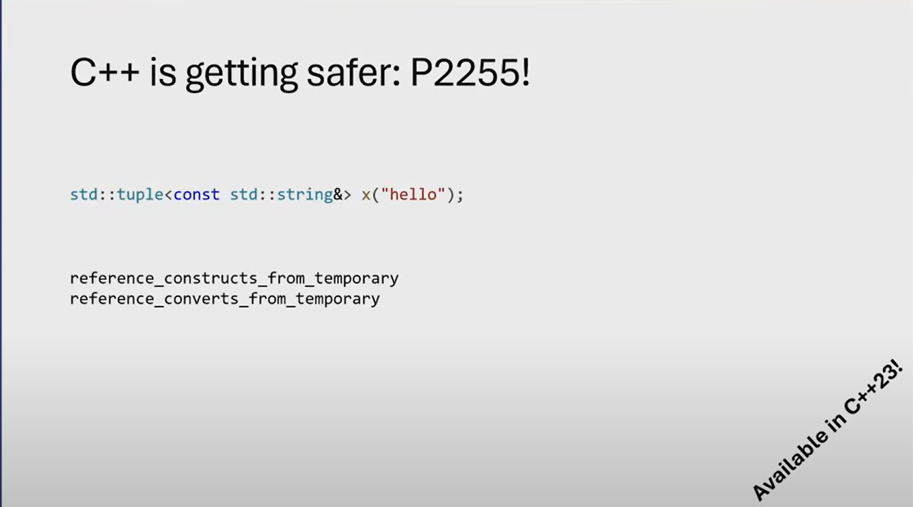

The code you provided has a **dangling pointer** issue. Let's break it down and understand why.

### Code:
```cpp
std::tuple<const std::string&> x("hello");
```

### Explanation:
1. **What is a Dangling Pointer?**
   - A dangling pointer occurs when a pointer or reference points to a memory location that has already been deallocated or gone out of scope. Accessing such a pointer or reference leads to undefined behavior.

2. **What Happens in the Code?**
   - The code creates a `std::tuple` that holds a **reference to a `const std::string`**.
   - The argument `"hello"` is a string literal, which is a temporary `const char*`. When you pass it to the tuple, it implicitly constructs a temporary `std::string` object.
   - The tuple stores a **reference** to this temporary `std::string`.

3. **Why is it a Dangling Pointer?**
   - The temporary `std::string` object created from `"hello"` is destroyed at the end of the full expression (i.e., after the statement `std::tuple<const std::string&> x("hello");` is executed).
   - Once the temporary object is destroyed, the reference inside the tuple (`const std::string&`) becomes a **dangling reference** because it points to an object that no longer exists.

4. **Undefined Behavior**:
   - Accessing the reference in the tuple after the temporary object is destroyed will result in **undefined behavior**. This could cause crashes, garbage values, or other unpredictable behavior.

---

### Correct Way to Fix the Issue:
To avoid the dangling reference, you should ensure that the referenced object outlives the tuple. Here are two ways to fix it:

#### 1. Store the String in a Variable:
```cpp
#include <iostream>
#include <tuple>
#include <string>

int main() {
    std::string str = "hello"; // Create a string object that outlives the tuple
    std::tuple<const std::string&> x(str); // Store a reference to the string

    // Access the tuple
    std::cout << std::get<0>(x) << std::endl; // Safe: str is still valid
    return 0;
}
```

#### 2. Store the String by Value (Not by Reference):
If you don't need a reference, store the string by value in the tuple:
```cpp
#include <iostream>
#include <tuple>
#include <string>

int main() {
    std::tuple<std::string> x("hello"); // Store the string by value

    // Access the tuple
    std::cout << std::get<0>(x) << std::endl; // Safe: the string is part of the tuple
    return 0;
}
```

---

### Key Takeaways:
- **Temporary objects** are destroyed at the end of the full expression, so storing a reference to them leads to dangling references.
- Always ensure that the lifetime of the referenced object is longer than the lifetime of the reference.
- If you don't need a reference, store the object by value in the tuple.


----------------------------------------------------------------------------------------------------------

In the code `std::tuple<const std::string&> x("hello");`, the concepts of **reference_constructs_from_temporary** and **reference_converts_from_temporary** come into play. These concepts describe how references interact with temporary objects during construction or conversion.

Let's break it down:

---

### 1. **What Happens in the Code?**
```cpp
std::tuple<const std::string&> x("hello");
```
- The tuple `x` is declared to hold a `const std::string&` (a reference to a `const std::string`).
- The argument `"hello"` is a string literal, which is a temporary `const char*`.
- To initialize the `const std::string&` inside the tuple, the compiler implicitly constructs a temporary `std::string` object from the string literal `"hello"`.

---

### 2. **Temporary Object Lifetime**
- A temporary object (in this case, the `std::string` created from `"hello"`) is destroyed at the end of the full expression in which it is created.
- In this case, the temporary `std::string` is destroyed immediately after the tuple is constructed.

---

### 3. **Reference Binding to a Temporary**
- The tuple stores a `const std::string&`, which is a reference to a `const std::string`.
- In C++, it is allowed to bind a `const` reference to a temporary object. This extends the lifetime of the temporary object to the lifetime of the reference.
- However, in this case, the reference is stored inside the tuple, and the temporary object is destroyed at the end of the full expression. This results in a **dangling reference**.

---

### 4. **`reference_constructs_from_temporary` and `reference_converts_from_temporary`**
These are type traits introduced in C++23 to detect whether a reference is being constructed or converted from a temporary object.

#### a) **`reference_constructs_from_temporary`**
- This trait checks if a reference type (`T&` or `const T&`) can be constructed from a temporary object of a given type.
- In this case:
  ```cpp
  std::reference_constructs_from_temporary<const std::string&, const char*>
  ```
  would evaluate to `true` because a `const std::string&` can be constructed from a temporary `std::string` created from a `const char*`.

#### b) **`reference_converts_from_temporary`**
- This trait checks if a reference type can be converted from a temporary object of a given type.
- In this case:
  ```cpp
  std::reference_converts_from_temporary<const std::string&, const char*>
  ```
  would also evaluate to `true` because a `const std::string&` can be converted from a temporary `std::string` created from a `const char*`.

---

### 5. **Why is This Dangerous?**
- Binding a reference to a temporary object is allowed, but storing that reference in a longer-lived object (like a tuple) leads to a **dangling reference**.
- When the temporary object is destroyed, the reference inside the tuple becomes invalid, and accessing it results in **undefined behavior**.

---

### 6. **How to Fix It?**
To avoid dangling references, you can:
1. **Store the object by value**:
   ```cpp
   std::tuple<std::string> x("hello");
   ```
   This ensures the `std::string` is part of the tuple and has the same lifetime as the tuple.

2. **Use a named object**:
   ```cpp
   std::string str = "hello";
   std::tuple<const std::string&> x(str);
   ```
   This ensures the referenced object (`str`) outlives the tuple.

---

### Example with Type Traits (C++23):
If you're using C++23, you can use `reference_constructs_from_temporary` to detect this issue at compile time:

```cpp
#include <iostream>
#include <tuple>
#include <string>
#include <type_traits>

int main() {
    // Check if a const std::string& can be constructed from a const char*
    if constexpr (std::reference_constructs_from_temporary<const std::string&, const char*>) {
        std::cout << "Warning: Binding a reference to a temporary!" << std::endl;
    }

    // This will trigger the warning
    std::tuple<const std::string&> x("hello");

    return 0;
}
```

---

### Summary:
- `reference_constructs_from_temporary` and `reference_converts_from_temporary` are type traits that detect whether a reference can be constructed or converted from a temporary object.
- In the code `std::tuple<const std::string&> x("hello");`, the reference binds to a temporary `std::string`, leading to a dangling reference.
- To avoid this, store the object by value or ensure the referenced object outlives the tuple.