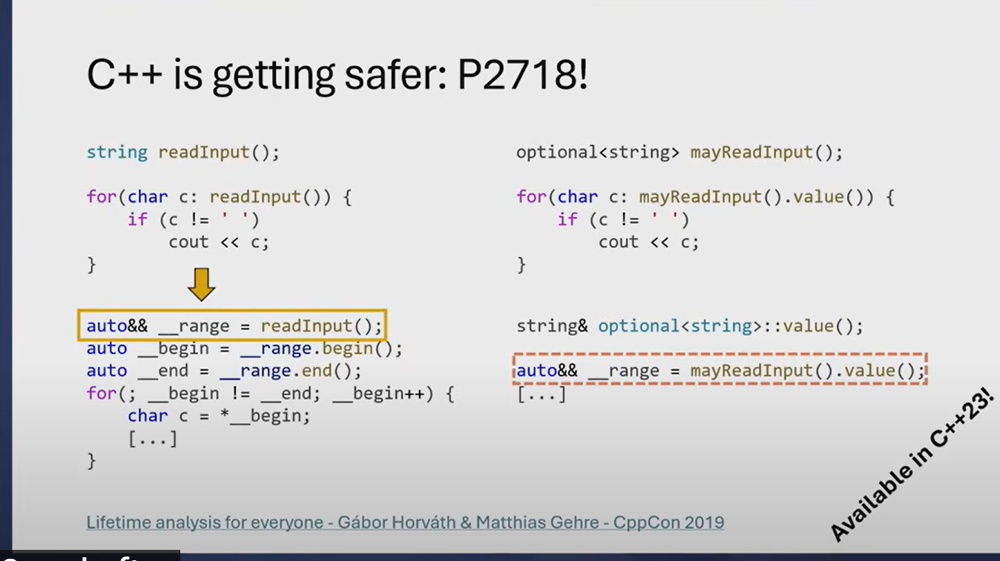

This image explains **C++ proposal P2718**, which improves the safety of range-based `for` loops, specifically when iterating over temporary objects. Let's analyze the details:

---

### **Left Side: Safe Case (`string readInput()`)**
```cpp
string readInput();

for (char c : readInput()) {
    if (c != ' ') cout << c;
}
```
#### **How this expands:**
```cpp
auto&& __range = readInput();  // Calls readInput(), binds to a temporary
auto __begin = __range.begin();
auto __end = __range.end();

for (; __begin != __end; ++__begin) {
    char c = *__begin;
    // Process c
}
```
#### **Why is this safe?**
- `readInput()` returns a `std::string` **by value**.
- The `auto&& __range` binds to this temporary **for the entire loop scope**.
- Since the temporary string persists throughout the loop execution, iterators remain valid.
- **No dangling reference issue.**

---

### **Right Side: Problematic Case (`optional<string> mayReadInput()`)**
```cpp
optional<string> mayReadInput();

for (char c : mayReadInput().value()) {  // Problematic
    if (c != ' ') cout << c;
}
```
#### **How this expands (before C++23 fix):**
```cpp
auto&& __range = mayReadInput().value();  // Calls value() on a temporary optional
auto __begin = __range.begin();
auto __end = __range.end();

for (; __begin != __end; ++__begin) {
    char c = *__begin;
}
```
#### **Why is this unsafe?**
- `mayReadInput()` **returns a temporary `std::optional<std::string>`**.
- `value()` on a temporary `std::optional` creates another **temporary `std::string`**.
- `auto&& __range = mayReadInput().value();` binds to this temporary **but the temporary is destroyed immediately**.
- The loop **tries to iterate over a destroyed object**, leading to **undefined behavior (dangling reference/iterator).**

---

### **Fix in C++23 (P2718)**
**C++23 prevents this issue by detecting cases where `value()` is called on an rvalue `std::optional` and avoids binding to a temporary.**  
Instead, it ensures a **persistent object** for the loop's lifetime.

- If `mayReadInput()` is an **rvalue**, `std::optional<std::string>::value()` is called, creating a **temporary string**.
- **C++23 prevents** binding `auto&& __range` to such a temporary.
- This avoids **dangling references** and **iterator invalidation**.

---

### **How to Avoid This Issue in Older C++ Versions**
Before C++23, you should manually **store the string** to avoid dangling references:
```cpp
std::optional<std::string> mayReadInput();

if (mayReadInput()) {
    std::string safeStr = mayReadInput().value();  // Store value safely
    for (char c : safeStr) {  
        cout << c;
    }
}
```
OR
```cpp
for (char c : mayReadInput().value_or("")) {  
    cout << c;  // Safe because value_or("") guarantees a valid string.
}
```

---

### **Conclusion**
- **C++23 (P2718) improves safety** by preventing iteration over temporary objects that would cause dangling references.
- **Before C++23**, you must manually store `value()` before iterating to avoid undefined behavior.
- **Using `value_or("")`** is a good alternative to ensure a valid string exists.

This proposal makes C++ safer by **detecting and preventing common pitfalls** when using `std::optional` in range-based `for` loops.