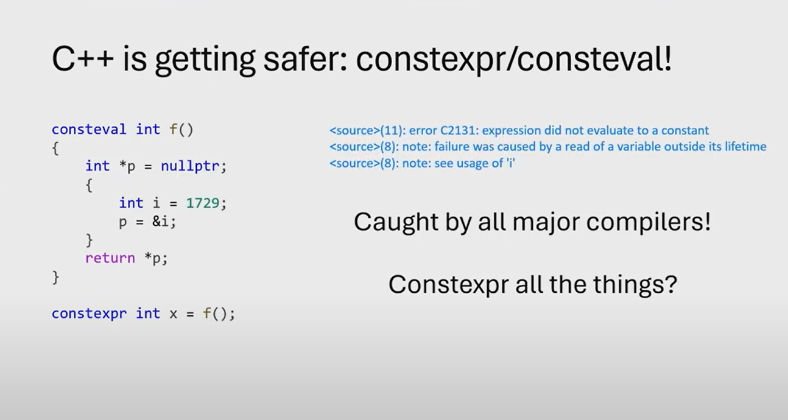

In C++, `constexpr` and `consteval` are keywords used to enable compile-time evaluation of functions and variables. They are part of C++'s effort to improve performance and safety by allowing computations to happen at compile time rather than runtime. Let's break down each keyword with examples.

---

### 1. `constexpr` (Introduced in C++11)
`constexpr` is used to indicate that a variable, function, or object can be evaluated at compile time. It ensures that the value or computation is constant and known during compilation.

#### Key Points:
- Can be applied to variables, functions, and constructors.
- Evaluated at compile time if all inputs are constant expressions.
- If inputs are not constant, it can still be used at runtime (but loses the compile-time guarantee).

---

#### Example 1: `constexpr` Variables
```cpp
#include <iostream>

int main() {
    constexpr int x = 10; // x is a compile-time constant
    constexpr int y = x + 5; // y is also a compile-time constant

    std::cout << "x: " << x << ", y: " << y << std::endl;
    return 0;
}
```
- Here, `x` and `y` are computed at compile time.

---

#### Example 2: `constexpr` Functions
```cpp
#include <iostream>

constexpr int square(int n) {
    return n * n;
}

int main() {
    constexpr int result = square(5); // Evaluated at compile time
    std::cout << "Square of 5: " << result << std::endl;

    int runtime_input = 6;
    std::cout << "Square of 6: " << square(runtime_input) << std::endl; // Evaluated at runtime
    return 0;
}
```
- `square(5)` is evaluated at compile time because the input is a constant.
- `square(runtime_input)` is evaluated at runtime because the input is not a constant.

---

#### Example 3: `constexpr` Constructors
```cpp
#include <iostream>

class Rectangle {
public:
    constexpr Rectangle(int w, int h) : width(w), height(h) {}
    constexpr int area() const { return width * height; }

private:
    int width, height;
};

int main() {
    constexpr Rectangle rect(3, 4); // Compile-time object
    constexpr int rect_area = rect.area(); // Compile-time calculation

    std::cout << "Area: " << rect_area << std::endl;
    return 0;
}
```
- The `Rectangle` object and its `area()` method are evaluated at compile time.

---

### 2. `consteval` (Introduced in C++20)
`consteval` is a stricter version of `constexpr`. It ensures that a function is **always** evaluated at compile time. If a `consteval` function cannot be evaluated at compile time, the program will not compile.

#### Key Points:
- Applies only to functions.
- Guarantees compile-time evaluation.
- Cannot be used at runtime.

---

#### Example: `consteval` Function
```cpp
#include <iostream>

consteval int cube(int n) {
    return n * n * n;
}

int main() {
    constexpr int result = cube(3); // Evaluated at compile time
    std::cout << "Cube of 3: " << result << std::endl;

    // int runtime_input = 4;
    // std::cout << "Cube of 4: " << cube(runtime_input) << std::endl; // ERROR: consteval function cannot be called at runtime
    return 0;
}
```
- `cube(3)` is evaluated at compile time.
- If you try to call `cube(runtime_input)` with a runtime value, the program will not compile.

---

### Key Differences Between `constexpr` and `consteval`
| Feature                | `constexpr`                          | `consteval`                          |
|------------------------|--------------------------------------|--------------------------------------|
| **Applicability**       | Variables, functions, constructors   | Functions only                       |
| **Evaluation Time**     | Compile-time or runtime              | Always compile-time                  |
| **Flexibility**         | Can be used at runtime if needed     | Must be evaluated at compile time    |
| **Introduced in**       | C++11                                | C++20                                |

---

### When to Use Which?
- Use `constexpr` when you want the flexibility of compile-time evaluation but still need the ability to use the function or variable at runtime.
- Use `consteval` when you want to enforce compile-time evaluation and ensure that the function cannot be used at runtime.

---

### Combined Example
```cpp
#include <iostream>

constexpr int add(int a, int b) {
    return a + b;
}

consteval int multiply(int a, int b) {
    return a * b;
}

int main() {
    constexpr int sum = add(2, 3); // Compile-time
    constexpr int product = multiply(2, 3); // Compile-time

    std::cout << "Sum: " << sum << ", Product: " << product << std::endl;

    int x = 5, y = 6;
    std::cout << "Runtime Sum: " << add(x, y) << std::endl; // Runtime
    // std::cout << "Runtime Product: " << multiply(x, y) << std::endl; // ERROR: consteval cannot be used at runtime
    return 0;
}
```

---

### Summary
- `constexpr` is flexible and allows both compile-time and runtime evaluation.
- `consteval` is strict and enforces compile-time evaluation only.
- Use `constexpr` for general-purpose compile-time computations and `consteval` when you need to guarantee compile-time evaluation.


--------------------------------------------------------------------------------------------------------------------

In C++, `constexpr` can be evaluated at **compile time** or **runtime**, depending on the context in which it is used. The key factor is whether all the inputs to the `constexpr` function or variable are **constant expressions** (known at compile time). Let’s break this down with examples.

---

### 1. **Compile-Time Evaluation with `constexpr`**
A `constexpr` function or variable is evaluated at compile time if:
- All its inputs are **constant expressions** (e.g., literals, `constexpr` variables, or other `constexpr` functions).
- The result is used in a context that requires a compile-time constant (e.g., array sizes, template arguments, or `constexpr` variables).

---

#### Example 1: Compile-Time Evaluation of `constexpr` Function
```cpp
#include <iostream>

constexpr int square(int n) {
    return n * n;
}

int main() {
    constexpr int result = square(5); // Compile-time evaluation
    std::cout << "Square of 5: " << result << std::endl;

    int arr[result]; // Using result as array size (requires compile-time constant)
    std::cout << "Array size: " << sizeof(arr) / sizeof(arr[0]) << std::endl;
    return 0;
}
```
- `square(5)` is evaluated at compile time because `5` is a constant expression.
- The result is used to define the size of an array, which requires a compile-time constant.

---

#### Example 2: Compile-Time Evaluation of `constexpr` Variable
```cpp
#include <iostream>

constexpr int x = 10; // Compile-time constant
constexpr int y = x + 5; // Compile-time evaluation

int main() {
    std::cout << "x: " << x << ", y: " << y << std::endl;
    return 0;
}
```
- `x` and `y` are evaluated at compile time because they are `constexpr` variables.

---

### 2. **Runtime Evaluation with `constexpr`**
A `constexpr` function is evaluated at runtime if:
- Its inputs are **not constant expressions** (e.g., runtime variables).
- The result is not required to be a compile-time constant.

---

#### Example 3: Runtime Evaluation of `constexpr` Function
```cpp
#include <iostream>

constexpr int square(int n) {
    return n * n;
}

int main() {
    int runtime_input;
    std::cout << "Enter a number: ";
    std::cin >> runtime_input;

    int result = square(runtime_input); // Runtime evaluation
    std::cout << "Square of " << runtime_input << ": " << result << std::endl;
    return 0;
}
```
- `square(runtime_input)` is evaluated at runtime because `runtime_input` is not a constant expression (it depends on user input).

---

#### Example 4: Runtime Evaluation with Non-Constant Inputs
```cpp
#include <iostream>

constexpr int add(int a, int b) {
    return a + b;
}

int main() {
    int x = 10, y = 20;
    int result = add(x, y); // Runtime evaluation
    std::cout << "Sum: " << result << std::endl;
    return 0;
}
```
- `add(x, y)` is evaluated at runtime because `x` and `y` are not constant expressions.

---

### 3. **Mixed Compile-Time and Runtime Usage**
A `constexpr` function can be used in both compile-time and runtime contexts, depending on the inputs.

---

#### Example 5: Mixed Usage of `constexpr` Function
```cpp
#include <iostream>

constexpr int factorial(int n) {
    return (n <= 1) ? 1 : n * factorial(n - 1);
}

int main() {
    constexpr int compile_time_result = factorial(5); // Compile-time evaluation
    std::cout << "Factorial of 5 (compile-time): " << compile_time_result << std::endl;

    int runtime_input;
    std::cout << "Enter a number: ";
    std::cin >> runtime_input;

    int runtime_result = factorial(runtime_input); // Runtime evaluation
    std::cout << "Factorial of " << runtime_input << " (runtime): " << runtime_result << std::endl;
    return 0;
}
```
- `factorial(5)` is evaluated at compile time because `5` is a constant expression.
- `factorial(runtime_input)` is evaluated at runtime because `runtime_input` is not a constant expression.

---

### 4. **When is Compile-Time Evaluation Required?**
Compile-time evaluation is required in certain contexts, such as:
- Array sizes.
- Template arguments.
- `constexpr` variable initialization.
- `static_assert` expressions.

---

#### Example 6: Compile-Time Evaluation Required
```cpp
#include <iostream>

constexpr int get_array_size() {
    return 10;
}

int main() {
    constexpr int size = get_array_size(); // Compile-time evaluation
    int arr[size]; // Array size must be a compile-time constant

    std::cout << "Array size: " << size << std::endl;
    return 0;
}
```
- `get_array_size()` must be evaluated at compile time because its result is used as an array size.

---

### 5. **Key Takeaways**
- `constexpr` functions and variables are evaluated at **compile time** if all inputs are constant expressions and the result is used in a context that requires a compile-time constant.
- `constexpr` functions are evaluated at **runtime** if any input is not a constant expression or if the result is not required to be a compile-time constant.
- `constexpr` provides flexibility, allowing the same function to be used in both compile-time and runtime contexts.

---

### Summary Table

| Context                          | Evaluation Time | Example                                   |
|----------------------------------|-----------------|------------------------------------------|
| All inputs are constant          | Compile-time    | `constexpr int x = square(5);`           |
| Any input is not constant        | Runtime         | `int x = square(runtime_input);`         |
| Result used in compile-time context | Compile-time    | `int arr[factorial(5)];`                 |
| Result used in runtime context   | Runtime         | `int x = factorial(runtime_input);`      |

By understanding these rules, you can effectively use `constexpr` to optimize your code and ensure compile-time computations where possible.


-----------------------------------------------------------------



The code snippet you provided demonstrates an important concept in C++ related to `consteval` and `constexpr`, specifically focusing on **lifetime issues** and **compile-time evaluation**. Let’s break it down step by step.

---

### Code Explanation

```cpp
consteval int f()
{
    int *p = nullptr;
    {
        int i = 1729;
        p = &i;
    }
    return *p;
}

constexpr int x = f();
```

1. **`consteval` Function**:
   - `consteval` ensures that the function `f()` must be evaluated at **compile time**.
   - Inside `f()`, a pointer `p` is initialized to `nullptr`.
   - A block scope is created, and a local variable `i` is initialized to `1729`.
   - The address of `i` is assigned to `p`.
   - After the block scope ends, `i` goes out of scope, and its lifetime ends.
   - The function attempts to return the value pointed to by `p`, which is now a **dangling pointer** (pointing to a variable that no longer exists).

2. **`constexpr` Variable**:
   - `constexpr int x = f();` attempts to initialize `x` with the result of `f()`.
   - Since `f()` is `consteval`, it must be evaluated at compile time.

---

### Error Explanation

The code produces a **compile-time error** because of the following issues:

1. **Lifetime Violation**:
   - The variable `i` is local to the inner block scope. Once the block ends, `i` goes out of scope, and its lifetime ends.
   - The pointer `p` still holds the address of `i`, but `i` no longer exists. This is a **dangling pointer**.
   - Accessing `*p` after `i` goes out of scope is **undefined behavior**.

2. **Compile-Time Evaluation**:
   - Since `f()` is `consteval`, it must be evaluated at compile time.
   - The compiler detects that the code attempts to read a variable (`i`) outside its lifetime, which is not allowed in a constant expression.
   - This results in the error:
     ```
     <source>(1): error C2131: expression did not evaluate to a constant
     <source>(8): note: failure was caused by a read of a variable outside its lifetime
     ```

---

### Why This is Important

- **Safety**: The error is caught at **compile time**, preventing undefined behavior at runtime. This makes C++ safer when using `constexpr` and `consteval`.
- **Lifetime Rules**: The example demonstrates that compile-time evaluation enforces strict rules about variable lifetimes. You cannot access a variable after its lifetime ends, even in a `consteval` function.
- **Compiler Enforcement**: All major compilers (GCC, Clang, MSVC) catch this error, ensuring consistent behavior across platforms.

---

### Corrected Code

To fix the issue, you need to ensure that the variable being accessed is valid throughout its use. For example:

```cpp
consteval int f()
{
    int i = 1729; // Move `i` outside the inner block
    int *p = &i;  // `p` points to `i`, which is still in scope
    return *p;    // Safe to dereference `p`
}

constexpr int x = f(); // Now valid
```

- Here, `i` is declared in the same scope as `p`, so its lifetime extends until the end of the function. This makes the code valid for compile-time evaluation.

---

### Key Takeaways

1. **`consteval`**:
   - Ensures that a function is evaluated at compile time.
   - Enforces strict rules about constant expressions and variable lifetimes.

2. **Lifetime Rules**:
   - Accessing a variable outside its lifetime is undefined behavior.
   - Compile-time evaluation catches such errors early.

3. **Safety**:
   - `constexpr` and `consteval` improve safety by catching errors at compile time.

4. **Compiler Enforcement**:
   - All major compilers enforce these rules, ensuring consistent behavior.

---

### Summary

The code snippet demonstrates a common mistake when using `consteval`: accessing a variable outside its lifetime. This results in a compile-time error, which is a good thing because it prevents undefined behavior. By understanding the rules of `constexpr` and `consteval`, you can write safer and more efficient C++ code.