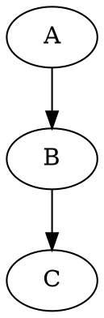

It seems that you've uploaded an image with a command in the terminal. Let's break it down and explain in detail what the command is doing:

### Command Breakdown

The command in the image is:

```bash
cd build && cmake .. --graphviz=graph.dot && dot -Tpng graph.dot -o graph.png
```

Let's break this down step by step:

1. **`cd build`**:
   - This part of the command is changing the current directory to the `build` directory. It assumes that you are running this command from the root of your project and that a `build` directory exists.
   - This is typically done to keep the build files separate from the source files (out-of-source build). It allows you to generate build artifacts in one place while keeping the source directory clean.

2. **`&& cmake .. --graphviz=graph.dot`**:
   - This runs the `cmake` command to configure the project in the parent directory (`..`), which is where the `CMakeLists.txt` file is located.
   - The `--graphviz=graph.dot` option tells CMake to generate a dependency graph in the Graphviz DOT format. This DOT file will describe the relationships and dependencies between the targets (e.g., executables, libraries) in your project.
   - The `graph.dot` file will be created in the `build` directory after running this CMake command.

3. **`&& dot -Tpng graph.dot -o graph.png`**:
   - After generating the `graph.dot` file, this part of the command uses the `dot` tool, which is part of the Graphviz software suite. The `dot` tool is used to generate graphical visualizations from DOT files.
   - The `-Tpng` flag tells `dot` to generate the output in PNG format.
   - `graph.dot` is the input file (generated by CMake), and `-o graph.png` specifies the output file name where the PNG image will be saved (in this case, `graph.png`).

### What Does This Command Do?

1. **Changes Directory**: It navigates to the `build` directory, which is typically where the project is configured and compiled.
2. **Generates Dependency Graph**: It runs the `cmake` command with the `--graphviz=graph.dot` option to generate a dependency graph of the project's targets in the `graph.dot` file.
3. **Generates Image from DOT File**: It then uses Graphviz's `dot` tool to convert the DOT file into a PNG image, which visually represents the dependencies of the project.

### Why Would You Use This?

This set of commands is useful when you want to visualize the dependencies between different parts of your CMake project. Here's why you might use it:

- **Visualize Dependencies**: CMake can generate a graph that shows how different targets (like executables and libraries) depend on each other, helping you understand the build structure better.
- **Debugging**: If you're having issues with missing or circular dependencies, a visual graph can help you identify the cause of the problem.
- **Documentation**: You might want to include this graph in your documentation to explain the structure of the project or its dependencies.
  
### Example Scenario

Imagine you have a project with the following structure:

```
my_project/
├── CMakeLists.txt
├── src/
│   ├── main.cpp
│   ├── lib1.cpp
│   └── lib2.cpp
└── build/
```

In the `CMakeLists.txt`, you might define an executable `my_project_exec` that depends on two libraries `lib1` and `lib2`.

When you run the command:

```bash
cd build && cmake .. --graphviz=graph.dot && dot -Tpng graph.dot -o graph.png
```

It would generate a `graph.dot` file showing the dependencies like:

- `my_project_exec` depends on `lib1` and `lib2`.
- `lib1` and `lib2` may have their own dependencies.

The output PNG (`graph.png`) would look like a graph where nodes represent targets (like `my_project_exec`, `lib1`, `lib2`), and edges represent the dependencies between them. This is useful for understanding how everything fits together and tracking down potential issues in your build configuration.

### Conclusion

This command sequence is a way to:

- Generate a project dependency graph with CMake.
- Convert that graph into a visual format (PNG) using Graphviz.

It’s helpful for understanding, documenting, or troubleshooting your project's build system by visualizing how different components depend on each other.

-----------------------------

**Graphviz** is an open-source software suite used for **graph visualization**. It provides tools to represent structural information as diagrams of abstract graphs and networks.

### Key Points:
1. **DOT Language**: Graphviz uses the **DOT** language to describe graphs. You define nodes (elements) and edges (connections) in a plain text format, and Graphviz generates visual representations of these graphs.
2. **Graph Types**: It supports both **directed** (with arrows) and **undirected** graphs, as well as various layouts (e.g., hierarchical, radial, and circular).
3. **Tools**: The main tool in Graphviz is `dot`, which generates graphical images (like PNG, PDF, SVG) from DOT files.

### Common Use Cases:
- **Dependency visualization**: Visualizing software module dependencies (e.g., CMake's `--graphviz`).
- **Network diagrams**: Representing networks, flowcharts, and state machines.
- **Organizational charts**: Representing hierarchical structures.

### Example:

If you have a simple graph with nodes A, B, and C, and edges between them:



Running this with Graphviz generates a visual representation where:
- A points to B, and
- B points to C.

### Why Use Graphviz?
- **Clear visualization**: Helps you understand complex relationships in data or systems.
- **Customizable layouts**: Various algorithms and options for rendering your graphs.
