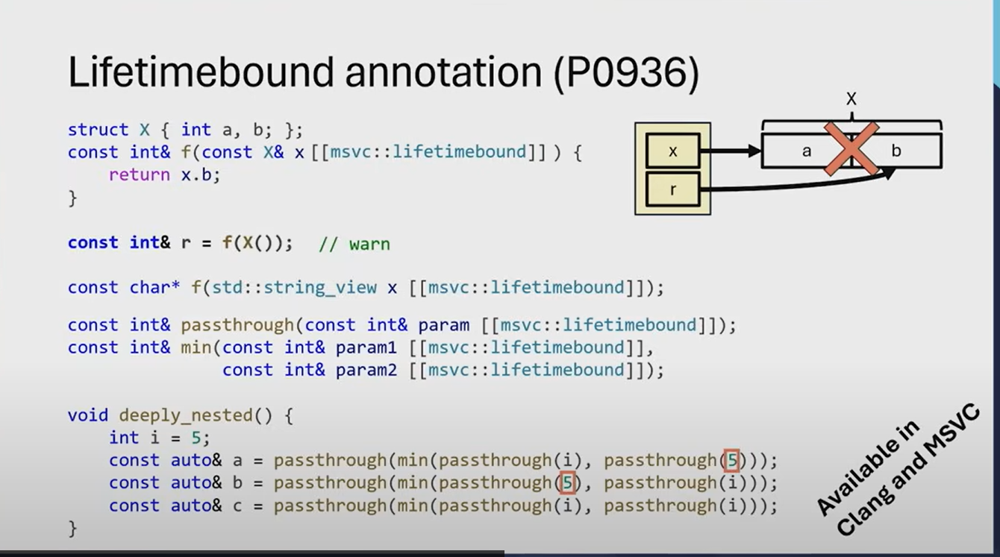

The `[[clang::lifetimebound]]` annotation is a **Clang-specific attribute** (also supported by MSVC) used in C++ to help developers enforce **lifetime safety** in their code. It is designed to catch potential bugs where a reference or pointer outlives the object it points to, which can lead to **dangling references** or **use-after-free** errors.

---

### What Does `[[clang::lifetimebound]]` Do?
- The attribute marks a function parameter (typically a reference or pointer) as being **lifetime-bound** to another object.
- It tells the compiler to issue a warning or error if the lifetime of the returned reference or pointer is not tied to the lifetime of the input parameter.
- This helps prevent scenarios where a function returns a reference or pointer to a temporary object or a local variable, which would result in undefined behavior.

---

### Syntax
```cpp
ReturnType FunctionName([[clang::lifetimebound]] ParameterType& parameter);
```

- The attribute is applied to a function parameter (usually a reference or pointer).
- The compiler will enforce that the lifetime of the returned object is tied to the lifetime of the annotated parameter.

---

### Example

```cpp
#include <iostream>

class MyClass {
public:
    int value;
};

// Annotate the parameter as lifetime-bound
MyClass& GetReference([[clang::lifetimebound]] MyClass& obj) {
    return obj;
}

int main() {
    MyClass obj{42};
    MyClass& ref = GetReference(obj); // OK: obj outlives ref

    // Dangerous: temporary object will be destroyed, leaving ref dangling
    MyClass& bad_ref = GetReference(MyClass{100}); // Warning/error from compiler

    std::cout << ref.value << std::endl; // OK
    std::cout << bad_ref.value << std::endl; // Undefined behavior

    return 0;
}
```

In this example:
- The `GetReference` function is annotated with `[[clang::lifetimebound]]` on its parameter.
- The compiler will warn or error if you pass a temporary object (like `MyClass{100}`) because the returned reference would outlive the temporary object.

---

### Supported Compilers
- **Clang**: Fully supported.
- **MSVC**: Also supports this attribute (as of recent versions).
- **GCC**: Does not support this attribute natively, but similar functionality can be achieved with static analysis tools or custom annotations.

---

### Why Use `[[clang::lifetimebound]]`?
- **Safety**: Helps catch lifetime-related bugs at compile time.
- **Clarity**: Makes it explicit that a function's return value depends on the lifetime of its input.
- **Modern C++**: Encourages safer coding practices, especially in codebases where lifetime management is critical.

---

### Limitations
- It is a **non-standard attribute**, so it is not portable across all compilers.
- It relies on the compiler's ability to analyze lifetimes, which may not always catch every edge case.

---

### Alternatives
If you need similar functionality in GCC or other compilers, you can:
- Use static analysis tools (e.g., Clang-Tidy, Cppcheck).
- Manually enforce lifetime rules through code reviews and design patterns (e.g., avoiding returning references to local variables).

In summary, `[[clang::lifetimebound]]` is a powerful tool for improving lifetime safety in C++ code, especially when working with references and pointers.


--------------------------------------------------------------

The compiler doesn't automatically enforce lifetime safety (like detecting dangling references) in all cases because **C++ is designed to be a highly flexible and performant language**, and enforcing strict lifetime rules everywhere would impose significant limitations on what you can do. Here's a deeper explanation of why the compiler doesn't automatically catch these issues and why annotations like `[[clang::lifetimebound]]` are necessary:

---

### 1. **C++ Philosophy: Trust the Programmer**
   - C++ is built on the principle of giving programmers **full control** over memory and resources.
   - This means the language allows you to do things that are potentially unsafe (e.g., returning references to local variables, using raw pointers) because they can be useful in certain low-level or performance-critical scenarios.
   - The compiler assumes you know what you're doing and won't automatically restrict you unless it's absolutely necessary (e.g., syntax errors or type mismatches).

---

### 2. **Complexity of Lifetime Analysis**
   - Automatically determining the lifetime of every object and reference in a program is a **hard problem**. It requires sophisticated static analysis and can be computationally expensive.
   - In many cases, the compiler cannot definitively prove whether a reference will outlive the object it points to, especially in complex codebases with dynamic memory allocation, function pointers, or indirect control flow.
   - For example:
     ```cpp
     int* foo(bool condition) {
         int x = 10;
         int y = 20;
         return condition ? &x : &y; // Which one will be returned? Compiler can't always know.
     }
     ```
     Here, the compiler cannot easily determine if the returned pointer will outlive the local variables `x` and `y`.

---

### 3. **Trade-Offs in Compiler Design**
   - Compilers prioritize **performance** and **compile-time speed**. Adding comprehensive lifetime analysis to every compilation would slow down the process significantly.
   - Instead, compilers focus on **local analysis** (e.g., within a single function) and leave more complex lifetime issues to static analysis tools or runtime checks (e.g., AddressSanitizer).

---

### 4. **Annotations Provide Explicit Intent**
   - Annotations like `[[clang::lifetimebound]]` allow you to **explicitly communicate your intent** to the compiler.
   - By marking a parameter as lifetime-bound, you're telling the compiler: "This reference/pointer must not outlive the object it points to." This gives the compiler more information to work with and enables it to issue warnings or errors in specific cases.
   - Without annotations, the compiler would have to guess your intent, which could lead to false positives or missed issues.

---

### 5. **Backward Compatibility**
   - C++ has decades of legacy code, and introducing strict lifetime enforcement by default could break existing programs.
   - Annotations provide a way to **opt-in** to stricter checks without disrupting older codebases.

---

### Why Use Annotations Like `[[clang::lifetimebound]]`?
Annotations are a practical compromise:
- They allow you to **enforce safety in critical parts of your code** without imposing unnecessary restrictions everywhere.
- They help the compiler **focus on specific areas** where lifetime issues are likely to occur.
- They make your code **more readable and maintainable** by explicitly documenting lifetime dependencies.

---

### Example of Why Annotations Are Needed
Consider this function:
```cpp
std::string& GetString() {
    std::string local = "Hello";
    return local; // Dangling reference!
}
```
The compiler might not warn you about this because:
- It assumes you know what you're doing.
- It doesn't automatically track the lifetime of `local` beyond the function scope.

With `[[clang::lifetimebound]]`, you can explicitly mark parameters that must outlive the returned reference:
```cpp
std::string& GetString([[clang::lifetimebound]] std::string& input) {
    return input; // Safe: input must outlive the returned reference.
}
```
Now the compiler can enforce that the caller provides a valid, long-lived object for `input`.

---

### Tools for Lifetime Safety
If you want more comprehensive lifetime analysis without annotations, you can use:
- **Static Analysis Tools**: Clang-Tidy, Cppcheck, etc.
- **Runtime Tools**: AddressSanitizer, Valgrind, etc.
- **Modern C++ Features**: Smart pointers (`std::shared_ptr`, `std::unique_ptr`) and containers to manage lifetimes automatically.

---

### Conclusion
The compiler doesn't automatically enforce lifetime safety because it would conflict with C++'s design goals of flexibility and performance. Annotations like `[[clang::lifetimebound]]` provide a way to **opt-in** to stricter checks in critical parts of your code, helping you catch bugs without sacrificing the language's power and expressiveness.