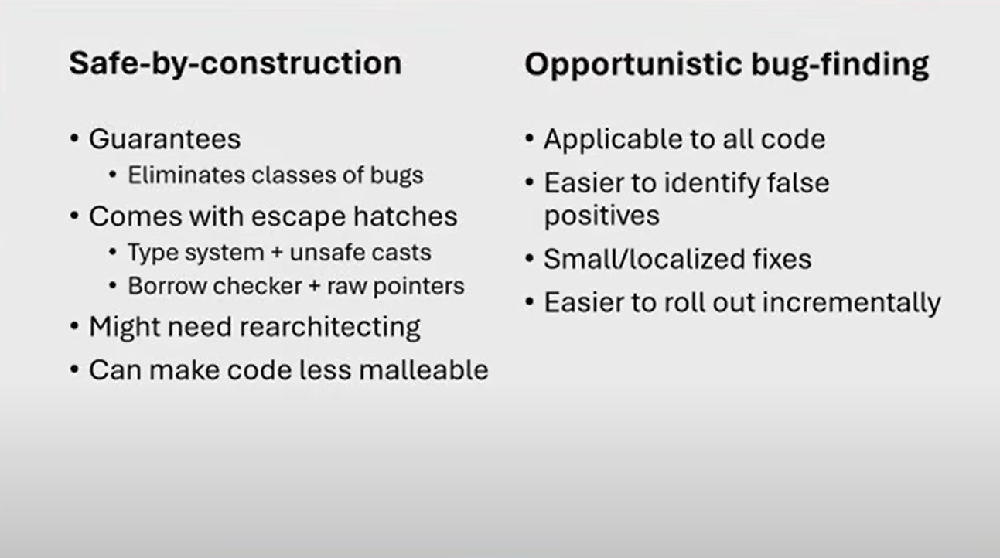

### Safe by Construction vs. Opportunistic Bug Finding

These are two complementary approaches to building reliable and secure software systems. Let me break them down for you:

---

### 1. **Safe by Construction**
This approach focuses on designing systems in a way that prevents bugs or vulnerabilities from being introduced in the first place. It emphasizes **correctness by design** and uses tools, methodologies, and programming paradigms that inherently reduce the likelihood of errors.

#### Key Characteristics:
- **Prevention over detection**: Bugs are avoided by using safe programming practices, languages, or frameworks.
- **Formal methods**: Mathematical proofs or formal verification techniques may be used to ensure correctness.
- **Language features**: Use of languages with built-in safety features (e.g., memory safety, type safety).
- **Design principles**: Modularity, encapsulation, and clear abstractions to minimize complexity.

#### Example:
- **Rust programming language**: Rust is designed to be memory-safe by construction. It uses ownership and borrowing rules to prevent common bugs like null pointer dereferencing, buffer overflows, and data races.
- **Static type systems**: Languages like Haskell or TypeScript enforce type safety at compile time, preventing type-related bugs.

---

### 2. **Opportunistic Bug Finding**
This approach focuses on **detecting and fixing bugs** after the system is built. It relies on tools and techniques to identify vulnerabilities or errors in existing code.

#### Key Characteristics:
- **Detection over prevention**: Bugs are found through testing, analysis, or runtime monitoring.
- **Dynamic analysis**: Tools like fuzzers, sanitizers, or runtime checkers are used to uncover issues.
- **Heuristic-based**: Often relies on patterns, heuristics, or known vulnerabilities to find bugs.
- **Iterative process**: Bugs are fixed as they are discovered, often in an ongoing cycle.

#### Example:
- **Fuzz testing**: Tools like AFL (American Fuzzy Lop) or libFuzzer automatically generate random inputs to test software and find crashes or unexpected behavior.
- **Static analysis tools**: Tools like Coverity or SonarQube analyze code for potential vulnerabilities or bugs without executing it.
- **Penetration testing**: Security experts manually probe a system for vulnerabilities.

---

### Comparison and Combined Approach

| **Aspect**               | **Safe by Construction**               | **Opportunistic Bug Finding**       |
|--------------------------|---------------------------------------|-------------------------------------|
| **Goal**                 | Prevent bugs during development       | Detect bugs after development       |
| **Focus**                | Design and methodology               | Testing and analysis                |
| **Tools**                | Formal methods, safe languages        | Fuzzers, static analyzers, linters  |
| **When Applied**         | During development                   | After development or during testing |

In practice, the two approaches are often combined:
1. **Safe by Construction** ensures the system is robust from the start.
2. **Opportunistic Bug Finding** catches any issues that slip through.

#### Example of Combined Approach:
- A team develops a web application using a memory-safe language like Rust (safe by construction).
- They also use fuzz testing and static analysis tools to find edge cases or logic errors (opportunistic bug finding).
- This combination results in a highly reliable and secure system.

---

### Summary
- **Safe by Construction** is about building systems correctly from the ground up.
- **Opportunistic Bug Finding** is about identifying and fixing issues in existing systems.
- Together, they provide a comprehensive strategy for creating reliable and secure software.