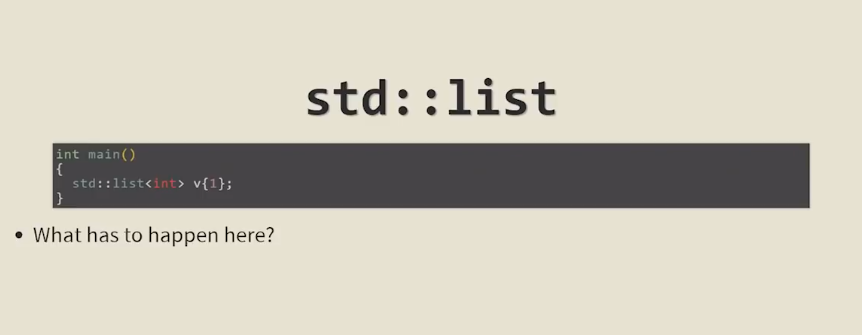

These two images illustrate how optimizing compilers can dramatically reduce complex high-level code into very simple machine instructions — a testament to their sophistication.

---

### 📄 **Image 1 Explanation: High-Level Code**

```cpp
#include <string>

int main()
{
    std::string s("a");
    return s.size();
}
```

This C++ program:

* Includes the `<string>` header for using `std::string`.
* In `main()`, creates a string `s` with value `"a"`.
* Returns the size of the string, which is `1`.

### ⚙️ **Image 2 Explanation: Optimized Assembly Output (g++ 5.1+)**

```asm
main:
    mov     eax, 1
    ret
```

This is the **entire assembly output** from compiling the code with optimization enabled (e.g., `-O2` or `-O3` with `g++ 5.1+`):

* `mov eax, 1`: The result (`1`) is directly loaded into the return register (`eax`).
* `ret`: Return from `main()`.

---

### 🤯 Why This Is Amazing

The compiler realizes:

* `std::string s("a")` creates a known constant string `"a"`.
* `s.size()` is always `1`, and nothing in the program modifies `s`.
* Therefore, it **optimizes away all the string construction logic**, directly returning `1`.

The optimizer essentially says: “This whole function will always return 1, so why bother doing all that work?”

---

### ✅ Takeaway

This is a great example of **constant folding** and **dead code elimination**:

* The compiler does not even generate code to create the string.
* It only keeps the essential outcome.

That's why the slide is titled:

> **Optimizing Compilers Are Amazing**

Because they truly are.

-------
-------
-------


Great observation — and this is a subtle but fascinating point about **how compilers perform optimizations** in different contexts.

---

### 📄 **Image 3 (High-Level Code)**

```cpp
#include <string>

int main()
{
    return std::string("a").size() + std::string("b").size();
}
```

This code constructs two temporary strings `"a"` and `"b"`, calls `.size()` on each, and returns their sum — which **logically is `1 + 1 = 2`**.

---

### ⚙️ **Image 4 (Assembly Output)**

This time, the compiler **did not optimize** the result to a simple `return 2`. Instead, the output shows:

* A complex series of function calls and memory manipulations.
* Calls to `std::string` constructors.
* Safety checks and error handling logic (e.g. `std::__throw_logic_error`).

---

### 🤔 **So Why Didn't the Compiler Just Return 2?**

Here’s why:

#### 1. **Temporary Objects & Side Effects**

Each `std::string("a")` and `std::string("b")` creates a **temporary object**. Although these constructors are trivial, the compiler may be conservative — it assumes that:

* `std::string` construction might have side effects.
* `std::string::size()` might be virtual (it's not, but optimization phases can be cautious).

So it generates full construction and method-call code.

#### 2. **Separate String Instances**

Because there are **two separate string instances**, the compiler may not combine their `.size()` results at compile time unless it sees that both strings are constant and have no observable side effects.

#### 3. **Optimization Limitations**

Some compilers or optimization levels might **not perform inter-statement constant folding** when it involves temporary object construction — unless **link-time optimization (LTO)** or more aggressive settings (like `-O3` + inlining + constexpr evaluation) are enabled.

---

### ✅ When Would It Return `2`?

If you change the code to something more *obviously constexpr-friendly*, like:

```cpp
constexpr int f() {
    return std::string("a").size() + std::string("b").size();
}
int main() {
    return f();
}
```

...or if you use **`constexpr` strings** with `std::string_view`, some compilers might optimize it fully.

---

### 🔁 Summary

| Scenario                                                    | Compiler Output                |
| ----------------------------------------------------------- | ------------------------------ |
| `std::string s("a"); return s.size();`                      | `mov eax, 1` (fully optimized) |
| `return std::string("a").size() + std::string("b").size();` | Full string construction logic |

🧠 **Lesson**: Optimizing compilers are amazing — but also cautious. If there's any chance of observable side effects, they err on the safe side unless optimization flags are pushed further or code is simplified.


-------
-------
-------





-------
-------
-------


-------
-------
-------


-------
-------
-------