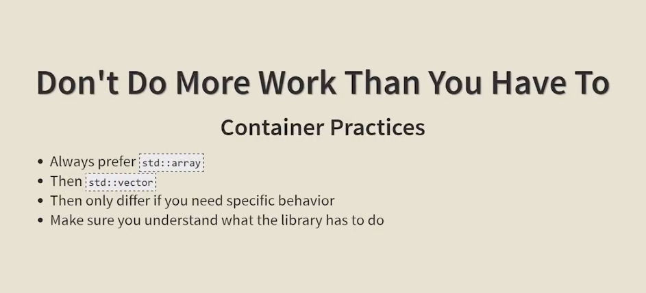
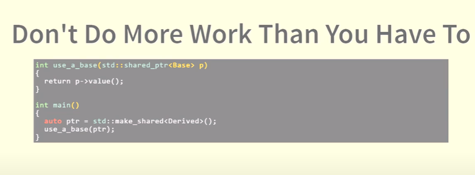
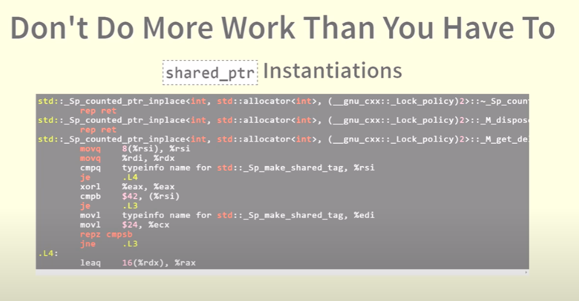
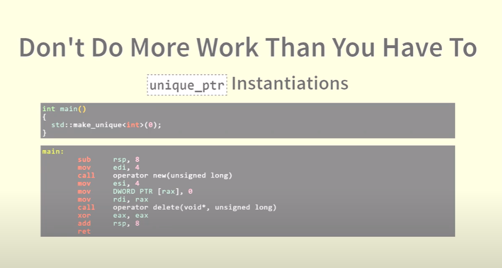

These two images illustrate how optimizing compilers can dramatically reduce complex high-level code into very simple machine instructions — a testament to their sophistication.

---

### 📄 **Image 1 Explanation: High-Level Code**

```cpp
#include <string>

int main()
{
    std::string s("a");
    return s.size();
}
```

This C++ program:

* Includes the `<string>` header for using `std::string`.
* In `main()`, creates a string `s` with value `"a"`.
* Returns the size of the string, which is `1`.

### ⚙️ **Image 2 Explanation: Optimized Assembly Output (g++ 5.1+)**

```asm
main:
    mov     eax, 1
    ret
```

This is the **entire assembly output** from compiling the code with optimization enabled (e.g., `-O2` or `-O3` with `g++ 5.1+`):

* `mov eax, 1`: The result (`1`) is directly loaded into the return register (`eax`).
* `ret`: Return from `main()`.

---

### 🤯 Why This Is Amazing

The compiler realizes:

* `std::string s("a")` creates a known constant string `"a"`.
* `s.size()` is always `1`, and nothing in the program modifies `s`.
* Therefore, it **optimizes away all the string construction logic**, directly returning `1`.

The optimizer essentially says: “This whole function will always return 1, so why bother doing all that work?”

---

### ✅ Takeaway

This is a great example of **constant folding** and **dead code elimination**:

* The compiler does not even generate code to create the string.
* It only keeps the essential outcome.

That's why the slide is titled:

> **Optimizing Compilers Are Amazing**

Because they truly are.

-------
-------
-------


Great observation — and this is a subtle but fascinating point about **how compilers perform optimizations** in different contexts.

---

### 📄 **Image 3 (High-Level Code)**

```cpp
#include <string>

int main()
{
    return std::string("a").size() + std::string("b").size();
}
```

This code constructs two temporary strings `"a"` and `"b"`, calls `.size()` on each, and returns their sum — which **logically is `1 + 1 = 2`**.

---

### ⚙️ **Image 4 (Assembly Output)**

This time, the compiler **did not optimize** the result to a simple `return 2`. Instead, the output shows:

* A complex series of function calls and memory manipulations.
* Calls to `std::string` constructors.
* Safety checks and error handling logic (e.g. `std::__throw_logic_error`).

---

### 🤔 **So Why Didn't the Compiler Just Return 2?**

Here’s why:

#### 1. **Temporary Objects & Side Effects**

Each `std::string("a")` and `std::string("b")` creates a **temporary object**. Although these constructors are trivial, the compiler may be conservative — it assumes that:

* `std::string` construction might have side effects.
* `std::string::size()` might be virtual (it's not, but optimization phases can be cautious).

So it generates full construction and method-call code.

#### 2. **Separate String Instances**

Because there are **two separate string instances**, the compiler may not combine their `.size()` results at compile time unless it sees that both strings are constant and have no observable side effects.

#### 3. **Optimization Limitations**

Some compilers or optimization levels might **not perform inter-statement constant folding** when it involves temporary object construction — unless **link-time optimization (LTO)** or more aggressive settings (like `-O3` + inlining + constexpr evaluation) are enabled.

---

### ✅ When Would It Return `2`?

If you change the code to something more *obviously constexpr-friendly*, like:

```cpp
constexpr int f() {
    return std::string("a").size() + std::string("b").size();
}
int main() {
    return f();
}
```

...or if you use **`constexpr` strings** with `std::string_view`, some compilers might optimize it fully.

---

### 🔁 Summary

| Scenario                                                    | Compiler Output                |
| ----------------------------------------------------------- | ------------------------------ |
| `std::string s("a"); return s.size();`                      | `mov eax, 1` (fully optimized) |
| `return std::string("a").size() + std::string("b").size();` | Full string construction logic |

🧠 **Lesson**: Optimizing compilers are amazing — but also cautious. If there's any chance of observable side effects, they err on the safe side unless optimization flags are pushed further or code is simplified.


-------
-------
-------




-------
-------
-------


-------
-------
-------


-------
-------
-------


This slide is from a C++ programming presentation and is addressing **efficient and correct use of virtual functions and destructors** in class hierarchies. Let’s break it down carefully.

---

### **Code Explanation**

```cpp
struct Base {
    virtual ~Base() = default;
    virtual void do_a_thing() = 0;
};

struct Derived : Base {
    virtual ~Derived() = default;
    void do_a_thing() override {}
};
```

#### 1. `virtual ~Base() = default;`

* This is good practice.
* It **ensures proper cleanup** when a derived object is deleted through a `Base*` pointer.
* Marking it `= default` tells the compiler to generate the destructor automatically.

#### 2. `virtual void do_a_thing() = 0;`

* This is a **pure virtual function**.
* It makes `Base` an **abstract class**, so you cannot instantiate `Base` directly.
* Forces derived classes to implement `do_a_thing()`.

#### 3. `virtual ~Derived() = default;`

* This line is **what the slide critiques**.
* While not *incorrect*, it’s **redundant**.

---

## 🧠 Key Concepts Explained

### ✅ Why `virtual ~Base()` is **necessary**

* If you ever write `Base* b = new Derived(); delete b;`, then `Derived`'s destructor must be called.
* If `~Base()` is **not virtual**, only `Base`'s destructor is invoked — leading to **resource leaks or undefined behavior**.

---

### ❌ Why `virtual ~Derived()` is **unnecessary**

* Since `Base` already has a `virtual` destructor, **all derived destructors are automatically virtual**, whether or not you write `virtual` again.
* Writing `virtual` on `~Derived()` is **redundant** and adds noise without benefit.

---

### 🧱 "Move construction / assignment is disabled"

This refers to:

```cpp
virtual ~Base() = default;
```

* **Virtual destructors inhibit move semantics** unless **explicitly defaulted**.
* When a class has a virtual destructor, the compiler does **not implicitly generate** move constructors and move assignment operators.
* This is because adding a virtual table (`vtable`) pointer changes the semantics of moving objects (especially slicing concerns).

So:

```cpp
struct Base {
    virtual ~Base() = default;
    Base(Base&&) = default;            // Add this if you want move constructor
    Base& operator=(Base&&) = default; // Add this if you want move assignment
};
```

---

### 📋 Summary of What’s Wrong

1. **Unnecessary Work**: `virtual ~Derived()` repeats `virtual`, which is implied.
2. **Subtle Limitation**: Move constructor and assignment operator aren't generated unless manually defaulted in presence of virtual destructor.

---

### ✅ Best Practice Version

```cpp
struct Base {
    virtual ~Base() = default;
    virtual void do_a_thing() = 0;
    Base(Base&&) = default;
    Base& operator=(Base&&) = default;
};

struct Derived : Base {
    ~Derived() = default; // no need to repeat `virtual`
    void do_a_thing() override {}
};
```


-------
-------
-------


-------
-------
-------




This image is giving advice in the context of C++ smart pointers and object slicing: **"Don't Do More Work Than You Have To"**. It illustrates an inefficiency that can occur when passing smart pointers by value rather than by reference.

---

### 🔍 Let's break down the code:

```cpp
int use_a_base(std::shared_ptr<Base> p)
{
    return p->value();
}
```

* This function takes a `shared_ptr<Base>` **by value**.
* This **increments the reference count** of the shared pointer, which involves atomic operations and is **relatively expensive**.
* If the function just wants to **read** or **use** the object without taking ownership or modifying the pointer, this is unnecessary overhead.

---

```cpp
int main()
{
    auto ptr = std::make_shared<Derived>();
    use_a_base(ptr);
}
```

* `ptr` is a `shared_ptr<Derived>`, which gets **implicitly converted** to a `shared_ptr<Base>` when passed to `use_a_base`.
* This conversion involves **creating a new shared pointer**, which internally points to the same control block but still **bumps the ref count**.

---

### 💡 The Better Way

To follow the advice "Don't Do More Work Than You Have To", you should **pass by `const&`** instead:

```cpp
int use_a_base(const std::shared_ptr<Base>& p)
{
    return p->value();
}
```

This way:

* You **avoid copying** the smart pointer.
* You **avoid incrementing/decrementing the reference count** unnecessarily.
* You **still ensure safety** because the function is not modifying the pointer.

---

### ✅ Summary

| Original Code             | Problem                                         |
| ------------------------- | ----------------------------------------------- |
| `std::shared_ptr<Base> p` | Copying increases ref count unnecessarily       |
| `use_a_base(ptr)`         | Causes extra work due to copy & type conversion |

**Solution:** Use `const std::shared_ptr<Base>& p` in the function parameter.


------------------
------------------
------------------
------------------
------------------


This slide is about performance optimization in C++ input/output (I/O) operations, specifically highlighting the cost of using `std::endl`.

### Title:

**"Don't Do More Work Than You Have To"**

This suggests we should avoid unnecessary operations, especially expensive ones, when coding.

---

### Focus: `std::endl`

#### Code Example:

```cpp
void println(ostream &os, const std::string &str)
{
    os << str << std::endl;
}
```

This function prints a string followed by `std::endl` to an output stream.

---

### Bullet Points Explanation:

* **What does `std::endl` do?**

  * It inserts a newline (`'\n'`) **and** **flushes the output buffer**.

* **It's equivalent to `'\n' << std::flush`**

  * This means `std::endl` not only moves to the next line but also forces all output to be written immediately to the output device, which is **more expensive**.

* **Expect that flush to cost you at least 9x overhead in your I/O**

  * Flushing the buffer frequently (e.g., with every line) can slow down your program significantly—up to 9 times or more.

---

### Conclusion:

Use `'\n'` instead of `std::endl` unless you specifically need to flush the output. This small change can drastically improve performance, especially in programs that produce a lot of output.


--------------
--------------
--------------
--------------

## ****


## ****




----
----

make_unique and make_shared are more concise than explicitly calling the constructor of unique_ptr and shared_ptr since they don’t require specifying the type multiple times and eliminate the need to use new.

make_unique and make_shared should also be preferred for exception-safety and performance reasons.

## Exception-Safety

While make_unique and make_shared are exception-safe, complex constructions of unique_ptr and shared_ptr might not be because C++ allows arbitrary order of evaluation of subexpressions (until C++17).

Consider this example:

f(unique_ptr<Lhs>(new Lhs()), throwingFunction());
The following scenario can happen:

Memory allocation for Lhs
Construction of the Lhs object
Call to throwingFunction (before the unique_ptr construction)
throwingFunction throws an exception
The constructed Lhs object is leaked since the unique_ptr isn’t constructed yet
Note: This scenario can only happen before C++17. Since C++17, the standard states that even though the order of evaluation of each argument is still unspecified, interleaving the evaluation of different arguments is no longer allowed. This makes the direct construction of unique_ptr and shared_ptr exception-safe.

## Performance

Using make_unique() doesn’t impact performance, but make_shared() improves it slightly.
Indeed, constructing explicitly a shared_ptr() requires two heap allocations: one for the managed object and the other for the control block that stores data about the ref-counts and the shared_ptr() deleter. make_shared() on the other hand, performs only one heap allocation.

Note: Because make_shared performs only one allocation for both the object and the control block, the memory occupied by the object will be deallocated when no shared_ptr or weak_ptr points to it. If the object is large, a weak_ptr is used, and memory is a concern, explicitly calling the constructor of shared_ptr may be preferred. This way, the object’s memory will be deallocated when there are no more shared owners, independently of any weak_ptrs.

Noncompliant code example
```
std::unique_ptr<MyClass> uniqueP(new MyClass(42)); // Noncompliant
std::shared_ptr<MyClass> sharedP(new MyClass(42)); // Noncompliant
```
Compliant solution
```
auto uniqueP = std::make_unique<MyClass>(42);
auto sharedP = std::make_shared<MyClass>(42);
```
Exceptions
This rule ignores code that uses features not supported by make_shared and make_unique:

custom deleters
```
std::unique_ptr<std::FILE, std::function<void(std::FILE*)>> file(
  fopen("example.txt", "r"),
  [](FILE* inFile) { fclose(inFile); }); // Compliant: custom deleter is specified
calling placement-new, i.e., version of new with arguments, like new(std::nothrow)
```
In addition, make_shared does not support the following:

custom operator new
allocating arrays (before C++20)

----
----

 
 

## ****

 

## ****

 

----
----
----


Certainly! This image discusses a C++ code snippet with an emphasis on template usage and its implications on code size and performance, summarized by the title "Smaller Code Is Faster Code."

---

### Breakdown of the Code

```cpp
struct B
{
    virtual ~B() = default; 
  virtual std::vector<int> get_vec() const = 0;
};

template<typename T>
struct D : B
{
    std::vector<int> get_vec() const override { return m_v; }
  std::vector<int> m_v;
};
```

---

### Explanation

1. **Base class `B`**:
   - Declares a **virtual destructor** with `= default` to allow proper cleanup of derived objects.
   - Declares a **pure virtual function** `get_vec()` returning a vector of integers (`std::vector<int>`) marked as `const` (it doesn't modify the object).

2. **Derived class template `D<T>`**:
   - Inherits from the base `B`.
   - Implements `get_vec()` to return its member vector `m_v`.
   - The class itself is a template, meaning multiple instantiations of `D` can exist for different type parameters `T`. The member vector `m_v` stores integers.

---

### What does the comment mean?

- **"With many template instantiations this code blows up in size quickly"**:
  
  Even though the method only returns `m_v` (which is `std::vector<int>`), because `D` is a template class, the compiler generates a separate version of `D` for each type `T` you use.

- Each instantiation of the template creates a separate copy of the `get_vec()` function and any other member functions/data. This can cause **code bloat**, meaning your resulting binary becomes larger due to many repeated copies of similar code.

---

### Summary in context

- **"Smaller Code Is Faster Code"** means that if your binary size is large due to many template instantiations, it could impact things like:
  - Cache efficiency
  - Load times
  - Overall program performance

- The slide hints at the importance of understanding how templates duplicate code for different types and how to balance flexibility and code size.


----
----
----


----
----
----


## ****


## ****

