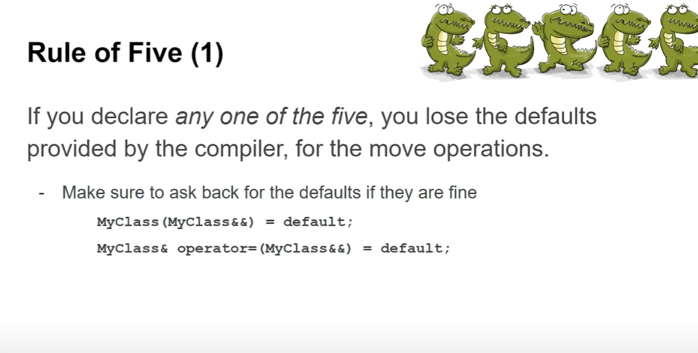
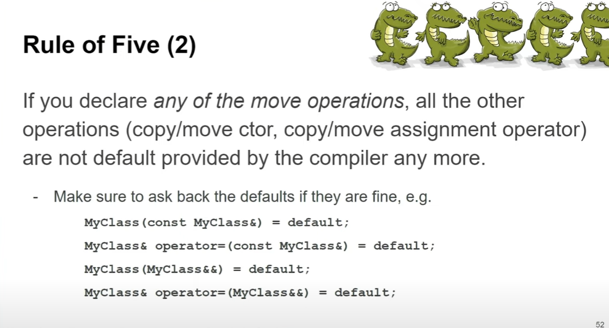

Certainly! These slides explain the **Rule of Five** in C++, especially about how declaring special member functions affects the compiler-generated defaults.

---

### Slide 1: Rule of Five (1)

- **Key point:**

  If you declare **any one** of the five special member functions, you **lose the compiler-generated defaults for the move operations**.

  The five special member functions are:
  1. Destructor
  2. Copy constructor
  3. Copy assignment operator
  4. Move constructor
  5. Move assignment operator

- The loss typically affects the **move constructor** and **move assignment operator**.

- **Advice:**  
  If the default move operations are good enough for your class, you should explicitly request them by writing:

  ```cpp
  MyClass(MyClass&&) = default;
  MyClass& operator=(MyClass&&) = default;
  ```

- This tells the compiler to give you the default move constructor/assignment even though you declared other special members.

---

### Slide 2: Rule of Five (2)

- **Key point:**

  If you declare **any of the move operations** (move constructor or move assignment), **all other operations** (copy/move constructors and copy/move assignment operators) **stop being compiler-generated automatically**.

- This means you must **explicitly declare** (or implement) the others if you want them. For example:

  ```cpp
  MyClass(const MyClass&) = default;
  MyClass& operator=(const MyClass&) = default;
  MyClass(MyClass&&) = default;
  MyClass& operator=(MyClass&&) = default;
  ```

- The idea is that declaring some special members disables automatic generation of others; to maintain all you want, you ask for them explicitly using `= default`.

---

### Why does this matter?

- Because if you implement some member functions yourself, the compiler assumes you are managing the behavior and resource management carefully, so it stops auto-generating the others to avoid mistakes.
- If you forget to provide needed constructors or assignment operators, the class might not behave correctly when copied or moved.

---

### Summary

- Declaring **any** of the five special members disables **some or all** of the compiler’s automatic generation of others.
- To keep defaults where appropriate, explicitly declare them with `= default`.
- This is about carefully managing copying and moving semantics in C++.

---


Tip | Explanation
Custom destructor → implicit move functions are suppressed | Even if you only write a user-defined destructor, the compiler will not implicitly generate the move-constructor or move-assignment operator. (The copy-ctor / copy-assignment will still be generated unless a data member is itself non-copyable.)

Custom copy-ctor or copy-assignment → implicit move functions are suppressed | As soon as you provide either copy operation, the compiler assumes you need deep copying, so an implicit “shallow” move would be unsafe and is therefore deleted.

Custom move-ctor or move-assignment → implicit copy functions are suppressed | Conversely, once you define a move operation, the default member-wise copy might be wrong, so both copy operations are implicitly deleted.

= default vs = delete | = default asks the compiler to generate the implementation that would have been produced; = delete forbids the function entirely and triggers a compile-time error on any call.
Rule of Zero | Delegate resource management to RAII helpers such as std::unique_ptr, std::vector, std::string, … so you need none of the five special functions.

Compiler warnings | Enable flags like -Wall -Wextra (GCC/Clang) or /W4 (MSVC). They clearly tell you when a move/copy function has been implicitly deleted, helping you catch problems early.