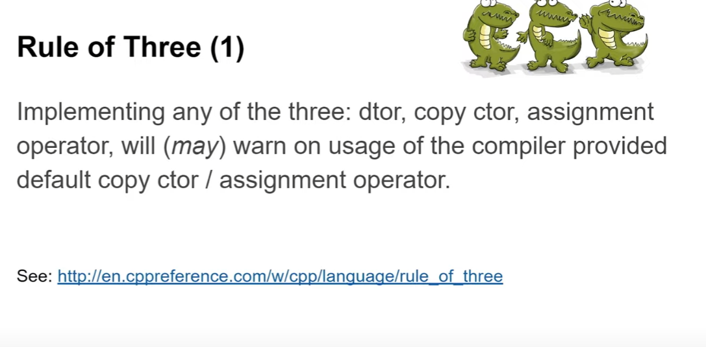

Certainly! These two slides explain the **Rule of Three** in C++ and give practical advice about managing special member functions.

---

### Slide 1: Rule of Three (1)

- **Main point:**

  If you implement **any one** of these three special functions:

  - Destructor (`~Class()`)
  - Copy constructor (`Class(const Class&)`)
  - Copy assignment operator (`Class& operator=(const Class&)`)

  then the compiler **may** warn you about potential issues when using the default versions for the others.

- Why? Because the compiler-generated default copy constructor or assignment operator might not do what you expect if you manage resources (like dynamic memory).

- This is a heads-up that you likely need to implement all three to ensure proper resource management and avoid bugs.

- The slide also references the official explanation on cppreference.com for more details.

---

### Slide 2: Rule of Three (2)

- **Advice when you need a destructor:**

  If your class **needs a destructor** (e.g., it manages raw dynamic memory and must `delete` it), then:

  - Immediately **block the copy constructor and copy assignment operator** by deleting them:
  
    ```cpp
    MyClass(const MyClass&) = delete;
    MyClass& operator=(const MyClass&) = delete;
    ```

  - This means you disable copying **for now** so that you don't accidentally allow unsafe shallow copies.

- After blocking copy operations, you can:

  - Either leave them deleted if copying doesn't make sense for your class,
  - Or implement proper copy constructor and copy assignment operator **later**, when you understand how to do it correctly.

- This approach helps avoid incomplete or incorrect implementations and prevents bugs caused by implicit shallow copy.

---

### Summary:

- In classes that manually manage resources, **if you declare a destructor, you should consider copying rules carefully**.
- Until you properly handle copying, **delete the copy constructor and copy assignment operator** to prevent misuse.
- This careful approach avoids subtle errors and clarifies intent.

---

----------------
----------------
----------------
----------------

These two slides are about the **Rule of Three** in C++ — a guideline that helps you write safe and correct classes when you're managing resources like memory, file handles, or sockets.

---

### 🔷 Slide 1: **Rule of Three (1)**

**Key Point:**  
If you implement **any one** of the following:
- Destructor (`~MyClass()`)
- Copy Constructor (`MyClass(const MyClass&)`)
- Copy Assignment Operator (`MyClass& operator=(const MyClass&)`)

Then you should probably implement **all three**.

**Why?**  
Because if you write a custom version of one, the default compiler-generated versions of the others might no longer be appropriate. For example, the default copy constructor may just copy pointers, not the actual resources they point to (which causes bugs like double deletion).

**Note:**  
The compiler *may* warn you if you forget to implement the others — but not always. So it’s a **best practice** to do it yourself.

---

### 🔷 Slide 2: **Rule of Three (2)**

**Key Point:**  
If you decide to write a destructor (usually because you're managing a resource), immediately **block** copying and assignment to prevent unintentional shallow copies.

Do this by deleting them:
```cpp
MyClass(const MyClass&) = delete;
MyClass& operator=(const MyClass&) = delete;
```

**Why block them?**  
Because leaving them enabled while only defining a destructor could lead to unsafe behavior (like double `delete`).

**Later...**  
If you *really* need to support copying or assignment, you can implement them safely (e.g., by performing deep copies).

---

### TL;DR

- If your class manages a resource: destructor + copy constructor + copy assignment must all be carefully implemented or explicitly deleted.
- Don’t rely on compiler defaults unless you’re sure they're safe.
