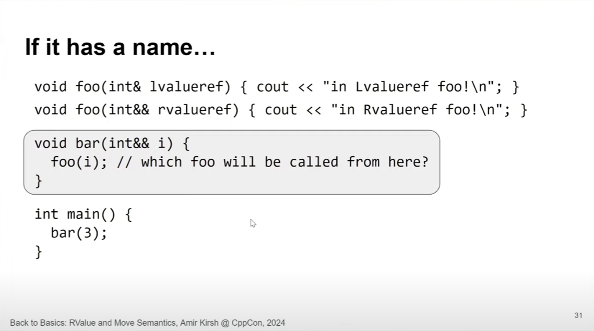
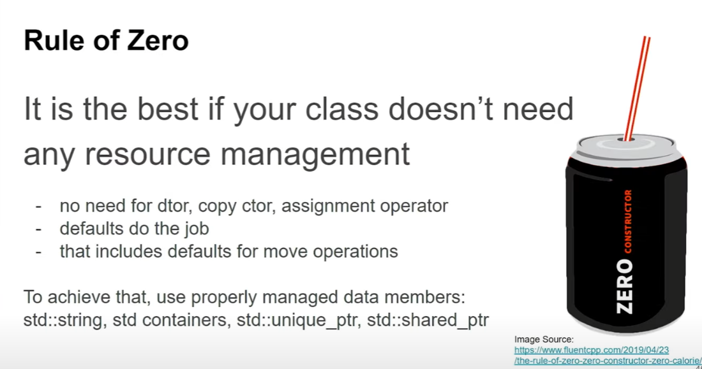

# **lvalue, rvalue, lvalue reference, rvalue reference** in C++ 

---

### 1. **lvalue (locator value)**

- **Definition:** An expression that refers to a memory location (basically something you can take the address of).
- **Example:** Variables, array elements, dereferenced pointers.
- **Use:** Has an identifiable location in memory.

```cpp
int x = 10;     // 'x' is an lvalue
x = 20;         // You can assign something to x (because it's an lvalue)

int* p = &x;    // You can take address of x, so x is lvalue
```

---

### 2. **rvalue (read value or right value)**

- **Definition:** An expression that is not an lvalue — usually a temporary value or literal; it doesn’t have a persistent memory address.
- **Example:** literals, the result of expressions, returned by some functions.

```cpp
int y = 5;      // 5 is an rvalue (a literal)
int z = x + y;  // 'x + y' is an rvalue (temporary expression result)
```

You **cannot assign** to rvalues—they don’t refer to a lasting memory location.

---

### 3. **lvalue references**

- Syntax: `int& ref = x;`
- An lvalue reference can bind only to an lvalue.
- Used to refer to an existing object, can be used to modify the original object.

```cpp
int x = 10;
int& ref = x;  // ref is an lvalue reference to x
ref = 20;      // changes x to 20
```

---

### 4. **rvalue references** (introduced in C++11)

- Syntax: `int&& ref = 5;`
- An rvalue reference can bind **only to rvalues** (temporaries).
- Used to implement move semantics and perfect forwarding. Enables you to "steal" resources from temporaries rather than copying them.

```cpp
int&& rref = 10;  // rref binds to temporary 10 (an rvalue)
```

---

### **Why do we need rvalue references?**

Imagine you have a class with dynamically allocated memory:

```cpp
class MyString {
    char* data;
public:
    MyString(const char* s) {
        data = new char[strlen(s) + 1];
        strcpy(data, s);
    }
    ~MyString() { delete[] data; }
    
    // Copy constructor (expensive)
    MyString(const MyString& other) {
        data = new char[strlen(other.data) + 1];
        strcpy(data, other.data);
    }
    
    // Move constructor (efficient)
    MyString(MyString&& other) noexcept {
        data = other.data; // steal resource pointer
        other.data = nullptr;  // nullify source to avoid double delete
    }
};
```

- **Copy constructor** duplicates data (expensive!).
- **Move constructor** transfers ownership of the existing data without copying (efficient!).

Without rvalue references, you’d be forced to copy all the time, which is slow.

---

### Summary Table

| Term             | Can Bind To       | Purpose                       | Example                    |
|------------------|-------------------|-------------------------------|----------------------------|
| **lvalue**       | Objects with name  | Refer to existing object       | `int x;`                   |
| **rvalue**       | Temporaries       | Temporary values, literals     | `5`, `x + y`               |
| **lvalue reference**  | lvalues only       | Refer to an existing object, modifiable | `int& ref = x;`           |
| **rvalue reference**  | rvalues only       | Implement move semantics         | `int&& rref = 10;`         |

---

### What problems does this solve?

- **Performance:** Move semantics (via rvalue references) avoid unnecessary copying for temporary objects.
- **Better resource management:** Enables efficient transfer of ownership (in classes managing dynamic memory or resources).
- **Cleaner code:** Allows perfect forwarding in templates, reducing code duplication.

---

### Quick example of move semantics

```cpp
MyString s1("Hello");
MyString s2 = std::move(s1);  // Moves s1 into s2, no deep copy
```

`std::move` casts an lvalue to an rvalue reference, enabling move semantics.

---

---------------------------------------------------
---------------------------------------------------
---------------------------------------------------
---------------------------------------------------
---------------------------------------------------


Great question! Usually, **lvalues** appear on the **left** side of an assignment, but they can definitely appear on the **right** side as well because they have a value and can be read.

### Simple example of an **lvalue on the right side**:

```cpp
int x = 10;    // x is an lvalue on the left side
int y = x;     // x is an lvalue on the right side now
```

Here, `x` is **an lvalue used on the right side** of the assignment to provide the value that goes into `y`.

---

### Why can lvalues appear on the right?

- Because **lvalues have a value** (stored in some memory), so you can read/use them in expressions.
- The assignment takes a value from the right (whether lvalue or rvalue) to assign to the left (which must be an lvalue).

---

### Another example:

```cpp
int a = 5;
int b = 10;
int c = a + b;  // 'a' and 'b' are lvalues appearing on the right side
```

Here `a` and `b` are lvalues used to calculate the right-side expression of the assignment to `c`.

---

**Summary:**

- **Lvalues can appear on the left or right of assignments.**
- They **must have a memory location**.
- **Rvalues only appear on the right.**

---


---------------------------------------------------
---------------------------------------------------
---------------------------------------------------
---------------------------------------------------
---------------------------------------------------

Great question! **`std::vector<bool>`** is a special case in C++ with a proxy type for its elements, which changes how lvalues and rvalues behave.

### Reminder: Normally, **rvalues cannot be on the left side** of assignment.

---

### What about `std::vector<bool>`?

- It does **not return a real reference (`bool&`)** on `operator[]` because `bool` is just 1 bit and can’t be referenced directly.
- Instead, **`vector<bool>::operator[]` returns a proxy object**, often named `reference` (a small helper class).
- This proxy **behaves like a reference**, allowing you to assign to it.

### Example:

```cpp
#include <vector>
#include <iostream>

int main() {
    std::vector<bool> v(1, false);

    // v[0] returns a proxy object (like a reference):
    v[0] = true;   // OK: assigning 'true' to proxy object

    // But what about rvalue on the left side?

    // std::move(v[0]) is an rvalue proxy:
    std::move(v[0]) = false;  // Also OK! Because operator= is defined on the proxy

    std::cout << v[0] << "\n";  // prints 0 (false) because we assigned false via rvalue
}
```

---

### What’s going on?

- `v[0]` is a **proxy object**, which is an **lvalue**.
- `std::move(v[0])` returns an **rvalue proxy object**.
- The proxy implements an **assignment operator** for itself, so **you can assign to the rvalue proxy**.

---

### So, in `std::vector<bool>`:

- The **proxy object** may **allow rvalues on the left side of assignment** because it overloads `operator=`.
- This is different from normal built-in types where **rvalues cannot be assigned to**.

---

### Summary:

| Expression            | Can sit at left side of assignment?                     |
|-----------------------|---------------------------------------------------------|
| lvalue (normal bool)  | Yes                                                     |
| rvalue (like `true`)  | No                                                      |
| `v[0]` (proxy lvalue) | Yes                                                     |
| `std::move(v[0])` (proxy rvalue) | Yes, because proxy has operator= overload |

---

This is an **exception due to the proxy design in `std::vector<bool>`**.

---


---------------------------------------------------
---------------------------------------------------
---------------------------------------------------
---------------------------------------------------
---------------------------------------------------

This little toy is just showing you how overload‐resolution treats lvalues, rvalues and (non-)constness:

```cpp
void foo(int&   lvalueref)  { cout << "in Lvalueref foo!\n"; }
void foo(int&&  rvalueref)  { cout << "in Rvalueref foo!\n"; }

int main() {
    int i   = 3;
    foo(i);    // i is a non-const lvalue → binds to foo(int&), prints “in Lvalueref foo!”
    foo(3);    // 3 is a prvalue         → binds to foo(int&&), prints “in Rvalueref foo!”
    const int j = i;
    foo(j);    // ?!
}
```

1. **`foo(i)`** → `i` is an _lvalue_ of type `int`, and `foo(int&)` takes a **non-const** lvalue reference, so that matches perfectly.

2. **`foo(3)`** → `3` is a _prvalue_ (rvalue) of type `int`, so it binds to the `int&&` overload.

3. **`foo(j)`** → `j` is an _lvalue_ **but** it’s `const int`.  
   - It cannot bind to `int&` (that requires a _non-const_ lvalue).  
   - It cannot bind to `int&&` (that requires an rvalue).  

Hence **neither** overload will accept `j` and the call is ill-formed: you get a compile-time “no matching function for call to `foo(const int)`” error.

If you wanted to handle const lvalues, you’d need yet another overload, e.g.:

```cpp
void foo(const int& cj) { cout << "in Const-L-value-ref foo!\n"; }
```

— that one would then catch the `foo(j)` call.


---------------------------------------------------
---------------------------------------------------
---------------------------------------------------
---------------------------------------------------
---------------------------------------------------


In C++, an **rvalue** can bind to a function parameter that is a **const lvalue reference** (`const &`). This is a special rule in C++ that allows temporary objects (rvalues) to be passed to functions expecting `const &` parameters without requiring an explicit copy.

### In C++ the reference-binding rules are designed around two ideas:
1. Safety: a reference must never dangle.
2. Efficiency & convenience: you should be able to pass both named objects (lvalues) and unnamed temporaries (rvalues) to ordinary functions without needless copying.

### Key Points:
1. **Rvalues** are temporary objects (e.g., literals, function returns, or expressions like `x + y`).
2. **`const &`** (const lvalue reference) can bind to both **lvalues** and **rvalues**.
3. This avoids unnecessary copies while ensuring the function cannot modify the original temporary object.

---

### Example:
```cpp
#include <iostream>

// Function taking a const lvalue reference
void printValue(const int &x) {
    std::cout << "Value: " << x << std::endl;
}

int getNumber() {
    return 42;  // Returns an rvalue
}

int main() {
    int a = 10;  // 'a' is an lvalue

    // Case 1: Passing an lvalue (works)
    printValue(a);

    // Case 2: Passing an rvalue (works due to const &)
    printValue(20);  // 20 is an rvalue

    // Case 3: Passing a function return (rvalue)
    printValue(getNumber());

    // Case 4: Passing an expression (rvalue)
    printValue(a + 5);  // (a + 5) is an rvalue

    return 0;
}
```

### Output:
```
Value: 10
Value: 20
Value: 42
Value: 15
```

### Explanation:
- The function `printValue(const int &x)` accepts both **lvalues** (`a`) and **rvalues** (`20`, `getNumber()`, `a + 5`).
- The `const &` ensures that the function cannot modify the passed object, making it safe for temporaries.
- This rule exists to improve efficiency by avoiding copies when passing temporary objects.

### Contrast with Non-const Lvalue References:
If the function took a **non-const lvalue reference** (`int &x`), it would **not** accept rvalues:
```cpp
void modifyValue(int &x) {
    x += 10;
}

int main() {
    int a = 10;
    modifyValue(a);  // OK: lvalue
    modifyValue(20); // ERROR: cannot bind rvalue to non-const &
}
```
This fails because modifying a temporary (rvalue) makes no sense, so C++ disallows it.

### Summary:
- **`const &`** can bind to **rvalues** (temporaries).
- **Non-const `&`** can only bind to **lvalues** (named objects).
- This rule enables efficient passing of temporary objects without copying.

---------------
---------------
---------------
---------------
---------------


```
#include <iostream>

using namespace std;

void foo(int&  lvalueRef)  { std::cout << "in l-value  foo\n"; }
void foo(int&& rvalueRef)  { std::cout << "in r-value  foo\n"; }

void bar(int&& i)
{
    std::cout << "-- inside bar\n";

    std::cout << "foo(i):";
    foo(i); // i has a *name* → it is an **lvalue** → calls foo(int&)

    std::cout << "foo(std::move(i)): ";
    foo(std::move(i)); // std::move turns it back into an **rvalue** → calls foo(int&&)
}

int main()
{
    bar(3); // 3 is an rvalue, so bar(int&&) is selected
}
```

Here’s what’s going on, line-by-line, and why the two calls to `foo` pick different overloads.

---

### 1.  Two overloads of `foo`

```cpp
void foo(int&  lvalueRef) { std::cout << "in l-value  foo\n"; }
void foo(int&& rvalueRef) { std::cout << "in r-value  foo\n"; }
```

* **`foo(int& )`** is selected when the argument is an **lvalue** (something that has a persistent identity you can take the address of).
* **`foo(int&&)`** is selected when the argument is an **xvalue/rvalue** (a “temporary” object that can be moved-from).

---

### 2.  `bar` takes an rvalue-reference **parameter**

```cpp
void bar(int&& i)
{
    std::cout << "-- inside bar\n";
```

*Because* you write `bar(3)` in `main`, overload resolution chooses `bar(int&&)`.  
Inside `bar` the parameter is named **`i`**. And here’s the first key rule:

> **Any named variable is always an lvalue** when you refer to it, no matter its original type.

So inside `bar` the expression `i` is an **lvalue of type `int`**.

---

### 3.  First call – `foo(i)`

```cpp
    foo(i);          // i is an lvalue → calls foo(int&)
```

Because `i` is an lvalue, the compiler prefers the `foo(int&)` overload, printing

```
in l-value  foo
```

---

### 4.  Second call – `foo(std::move(i))`

```cpp
    foo(std::move(i));  // std::move casts i to an rvalue → calls foo(int&&)
```

`std::move` doesn’t actually move anything; it’s just `static_cast<int&&>(i)`. The cast tells the compiler, “Treat this expression as an rvalue.” Now overload resolution picks `foo(int&&)`, printing

```
in r-value  foo
```

---

### 5.  `main` drives the whole thing

```cpp
int main()
{
    bar(3);   // 3 is a prvalue → matches bar(int&&)
}
```

* `3` is a pure rvalue (prvalue).  
* Overload resolution chooses `bar(int&&)`, binding that temporary to the parameter `i`.  
* Everything else follows as described.

---

### Complete runtime output

```
-- inside bar
foo(i):in l-value  foo
foo(std::move(i)): in r-value  foo
```

(The lack of a newline after “foo(i):” comes from the code’s `cout` formatting.)

---

## Why this matters

* **Correct overload selection**: Choosing between copying and moving (or between other lvalue/rvalue-specific operations) is the backbone of modern C++ efficiency.
* **Value-category awareness**: Remember that a variable’s declared type (`T&&`) and its *expression category* (lvalue/rvalue in a given context) are different things. You often need `std::move` or, in templates, `std::forward` to get the category you want.
* **Safety**: Don’t call `std::move` unless you really intend to treat the object as expendable after the move; it signals to readers (and to the compiler) that the value can be pilfered.


----------------------------
----------------------------
----------------------------
----------------------------
----------------------------


**Slide text (literal English translation)**

```
std::move

std::move is a cast to an r-value reference that preserves const-volatile (“cv”) qualifiers.

std::move doesn’t move
std::move merely prepares its argument to be moved, but it doesn’t actually
perform any move on its own!

std::string s2 = std::move(s1);
// The “move” happens here, when the move-constructor is called
```
(CppCon 2024 – “Back to Basics: R-value and Move Semantics”, Amir Kirsh)

---

### What it means

1. **What `std::move` really does**  
   It is nothing more than  
   ```cpp
   static_cast<T&&>(expr)
   ```  
   In other words, it tells the compiler “treat this expression as an r-value,” while keeping any `const`/`volatile` qualifiers intact. It does **not** relocate data.

2. **Why “`std::move` doesn’t move”**  
   Actual movement of resources occurs only when a *move-constructor* or *move-assignment operator* receives an r-value. `std::move` simply makes that possible by changing the **value category** of the argument.

3. **The example on the slide**  
   ```cpp
   std::string s2 = std::move(s1);
   ```  
   * `std::move(s1)` casts `s1` to an r-value.  
   * The move-constructor of `std::string` is then invoked to transfer `s1`’s internal buffer to `s2`.  
   * Therefore the real transfer happens in the initialization of `s2`, not inside `std::move`.

4. **Practical takeaway**  
   Use `std::move` when you want to hand an object over as a disposable temporary. Afterward, the source object remains in a *valid-but-unspecified* state, so only perform operations that are guaranteed safe (e.g., destroy it, assign a new value, or call methods documented as valid post-move).

**Bottom line:** `std::move` only *labels* the object as movable; the *move operation* itself is carried out by the receiving constructor or assignment operator.


---------------
---------------
---------------
---------------
---------------


### What the slide is asking

The slide shows a tiny generic function

```cpp
template<class T>
void foo(T& a, T& b) {
    T temp = std::move(a);   // ← here
    // do some more stuff
}
```

and then asks “Is it **valid** to `std::move` an **l-value** reference?” 
(The parameters `a` and `b` are both ordinary l-value references, `T&`.)

### How `std::move` really works

* `std::move(x)` **does not move** anything by itself.  
  It is nothing more than a cast:  

  ```cpp
  template<class U>
  constexpr std::remove_reference_t<U>&& move(U&& u) noexcept
  { return static_cast<std::remove_reference_t<U>&&>(u); }
  ```

* In other words it turns *any* expression you give it—even an l-value—into an r-value **expression**.  
  Whether an actual *move* happens depends on what constructor/assignment operator is selected **later**.

Because that cast is always legal, `std::move(a)` is always **well-formed C++**.  
So answers A and B (“won’t compile” / “warns”) are wrong.

### Is it Undefined Behaviour?

No. UB in C++ comes from using an object in a way the Standard forbids (out-of-bounds, double-free, etc.). Merely putting an object into a *moved-from* state is **defined behaviour**: the Standard says a moved-from object is still valid but its value is unspecified. So answer C is wrong as well.

### When moving from an l-value reference is *legit*

It can absolutely be the right thing to do—**if you really intend to give up the old value of `a` inside `foo()`.**

Typical, totally legitimate patterns:

```cpp
// Classic swap:
T temp = std::move(a);
a       = std::move(b);
b       = std::move(temp);
```

```cpp
// Efficient “consume-and-produce” algorithm:
out_vec.push_back(std::move(a));   // steal a’s guts
a.reinitialize();                  // give a fresh state
```

```cpp
// std::iter_swap’s inner loop eventually does the same trick
```

Notice all three cases satisfy the crucial rule:

> **After you move from an object, either destroy it or assign it a new value  
>  *before* you (or anyone else) rely on its contents.**

That rule is under *your* control inside `foo()`, so the cast is safe and useful.

### When it would be a mistake

* If `foo()` later needs the original value of `a`.  
* If the caller assumes `a` is untouched after the call and you don’t document otherwise.
* If `a` and `b` might alias the same object and the algorithm is not prepared for self-move.

Those are **logical** errors, not language-level UB: the code still compiles and runs, it just doesn’t do what you meant.

### So which multiple-choice answer is right?

> **D. “Yes, it can be legit in some cases.”**


----------------------------
----------------------------
----------------------------
----------------------------
----------------------------


Certainly! This slide explains a C++ concept called **"implicit move on return"**.

### What does it mean?

When you return a local object from a function, the compiler can automatically **move** the object instead of copying it, **without you explicitly calling `std::move()`**.

### Breakdown of the code:

```cpp
struct Moo {
    std::string s;
    // ...
};

Moo foo() {
    Moo moo {"hello"};
    return moo; // implicitly moved (do not call std::move()!)
}
```

- `Moo` is a simple struct containing a `std::string`.
- Inside the function `foo`, you create a local object `moo`.
- When you return `moo`, instead of copying it, the compiler *implicitly moves* the value, using the move constructor of `Moo` (assuming it has one, or the compiler generates one because `std::string` supports moving).

### Why is this important?

- **Performance:** Moving objects is usually much cheaper than copying (e.g., `std::string` can just transfer internal pointers rather than duplicating data).
- **Easier code:** You don't have to write `return std::move(moo);` manually. Just return the object, and the compiler optimizes the move for you.
- **Avoids bugs:** People sometimes mistakenly add `std::move()` on return, which can *prevent* certain optimizations (like Return Value Optimization, RVO). Trust the compiler to do the right thing.

### Summary:

- Returning a local variable by value will implicitly invoke move semantics if that variable is about to go out of scope.
- You **should not** use `std::move()` manually in the return statement in such cases — let the compiler handle it.

------
------
------
------

### Copy vs Move

When you return an object from a function, the compiler can do two things:

1. **Copy:**  
   Create a full copy of the object, duplicating all its data.  
   Example if copying:
   ```cpp
   Moo moo2 = moo; // copy constructor called
   ```
   This can be expensive, especially if the object holds a lot of data.

2. **Move:**  
   Instead of copying all the internal data, "steal" the resources from the original object. After a move, the original object is left in a valid but unspecified state (often empty).  
   Example if moving:
   ```cpp
   Moo moo2 = std::move(moo); // move constructor called
   ```
   This is much cheaper because it's like taking pointers rather than copying the data itself.

---

### What does `std::move` do?

`std::move` is a **cast** that tells the compiler:  
*"I want this object to be treated as something that can be moved from."*  

It does **not** move anything by itself but essentially allows the compiler to pick the move constructor or move assignment operator instead of copy.

---

### Why should you *not* call `std::move` in the return statement?

Example (not recommended):

```cpp
return std::move(moo);
```

- Here, when you explicitly call `std::move`, it **forces** the move.
- But modern compilers can already detect that `moo` is local and about to go out of scope, so they implicitly move it.
- Also, explicitly calling `std::move` can **disable some compiler optimizations** like Copy Elision / Return Value Optimization (RVO), which might let the compiler completely eliminate the copy or move altogether, improving performance even more.

---

### Summary

- **Returning a local object by value:** The compiler automatically uses move semantics if available.
- **`std::move` in a return:** Usually unnecessary, and sometimes harmful by preventing optimizations.
- Trust the compiler — **just write `return moo;`** and the compiler will do the optimal thing.

---


------------------------
------------------------
------------------------
------------------------
------------------------


Certainly! The slide poses the question:

### When do we need to implement the **move** operation?

It shows a simple class `Point`:

```cpp
class Point {
    int x, y;
public:
    // ctor, methods ...
};
```

### Explanation:

- The **move** being referred to here is likely about implementing **move constructor** or **move assignment operator** in C++.
- Move semantics are typically needed when your class **manages resources** that are expensive to copy, such as dynamic memory, file handles, sockets, or other system resources.
- The `Point` class contains just two `int` members, which are simple built-in types.
- For such simple classes without any resource management, the default copy and move operations provided by the compiler are sufficient.
- **Hence, you **do not** need to implement move semantics manually for this class.**

### Why?

- The compiler-generated move constructor and move assignment operator will just copy the integer values of `x` and `y`.
- Since `int` is a trivial type and cheap to copy, there is no performance gain in implementing move semantics explicitly.
- Move semantics are useful when you can "steal" ownership of resources from one object to another without expensive deep copies.

---

**In short:**  
For the `Point` class shown (just two integers), **you don't need to implement move semantics manually** because the default ones work fine.

------------------------
------------------------
------------------------
------------------------
------------------------


---

### The class given:

```cpp
class Person {
    long id;
    std::string name;
public:
    // ctor, methods ...
};
```

---

### The question again:  
**Do we need to implement move semantics (move constructor and move assignment operator) for this class?**

---

### Explanation:

- This class has two members:
  1. `long id` — a built-in simple type.
  2. `std::string name` — a standard library string, which **already implements efficient move semantics internally**.

- **Why no need for move semantics here?**  
  - `id` is trivially copyable and cheap to move.
  - `std::string` is a well-designed class that already supports move operations (i.e., it can efficiently transfer ownership of its internal buffer instead of copying).
  - The compiler will **automatically generate** a move constructor and move assignment operator that will call the move constructor or assignment operator of each member appropriately.
  
- So, your class `Person` will automatically have correct and efficient move semantics **without you writing any extra code**.

---

### Summary:

- Since `std::string` already supports move semantics and `long` is trivial, **there is no need to manually implement move semantics for the `Person` class.**
- The compiler-generated move constructor and move assignment operator will be sufficient and efficient.

---


------------------------
------------------------
------------------------
------------------------
------------------------



Absolutely! Let's break down the **Rule of Zero** explained in this slide.

---

### What is the *Rule of Zero*?

The **Rule of Zero** is a design guideline in C++ that encourages you to write classes **without explicitly managing resources such as memory, file handles, network sockets, etc.** 

---

### Key points from the slide:

- **"It is the best if your class doesn’t need any resource management."**

  This means:
  - You avoid manual management of resources inside your class.
  - Your class does *not* need to define:
    - Destructor (`dtors`)
    - Copy constructor
    - Copy assignment operator
    - Move constructor
    - Move assignment operator

- **Why?**  
  Because the **default implementations** generated by the C++ compiler already do the right thing *if you use proper types for members*.

- These **defaults** include:
  - Copying data members properly.
  - Moving data members efficiently.
  - Destroying data members safely.

- The best way to achieve this is to use **well-designed data members** that **manage their own resources properly**, such as:
  - `std::string` for strings (manages memory automatically).
  - Standard containers (`std::vector`, `std::map`, etc.) that automatically handle memory.
  - Smart pointers like `std::unique_ptr` and `std::shared_ptr` for dynamic memory ownership.

---

### Why is this better?

- It **simplifies code**: You have fewer functions to write and maintain.
- It **avoids bugs**: Manual resource management is error-prone (e.g., forgetting to free memory or double freeing).
- It **leverages existing, tested code** in the STL (Standard Template Library) that is optimized and safe.

---

### Summary

- **Rule of Zero** means: If possible, design your classes in a way that the compiler-generated versions of special functions (destructor, copy/move constructors, assignment operators) are enough.
- You achieve this by **using RAII-friendly types and smart pointers**, so your class members manage resources for you.
- This leads to cleaner, safer, and more maintainable C++ code.

---


------------------------
------------------------
------------------------
------------------------
------------------------


Certainly! This slide presents a class called `NamedArray` and asks the question:  
**What about this class?**

---

### The class definition:

```cpp
class NamedArray {
    size_t size;
    int* arr;
    std::string name;
public:
    // ctor, methods ...
};
```

---

### What makes this class special?

- `NamedArray` holds:
  - `size`: the size of the array.
  - `arr`: a raw pointer to a dynamically allocated array of `int`.
  - `name`: a `std::string`, which manages its own memory automatically.

---

### Why this class is different from previous examples?

- It **manages a resource manually**: the `int* arr` pointer, which points to dynamically allocated memory.
- This means you are responsible for:
  - Allocating `arr` (probably in constructor).
  - Deallocating `arr` (in destructor to avoid memory leaks).
  - Copying correctly (deep copy to avoid two objects pointing to same memory, avoiding double delete).
  - Moving correctly (to transfer ownership efficiently when possible).

---

### What about move semantics here?

- Since you manage raw dynamic memory, **you need to implement special member functions manually**:
  - Destructor (to delete `arr`).
  - Copy constructor and copy assignment (deep copies of array).
  - Move constructor and move assignment to transfer ownership fast without copying.

- Because of this, **move semantics are needed**, unlike previous simple cases like `Point` or `Person`.

---

### Skeleton and solutions provided:

The slide links to three example solutions:

1. **Skeleton for the solution**: A basic outline showing where to put constructors, destructors, etc.
   - [Skeleton code link](https://coliru.stacked-crooked.com/a/1e5bac3dcd358417)

2. **Solution 1 - with a need for std::move**: Implements move semantics correctly for optimal performance.
   - [Solution 1 link](https://coliru.stacked-crooked.com/a/06907d732f61dbca)

3. **Solution 2 - better design**: Possibly redesign the class to use smart pointers or containers to avoid manual memory management (applying Rule of Zero).
   - [Solution 2 link](https://coliru.stacked-crooked.com/a/3b9c4f0b05fc7241)

---

### Summary:

- This class needs you to manage dynamic memory manually.
- This requires following Rule of Five: implement destructor, copy/move constructors, copy/move assignment operators.
- Alternatively, redesign (`Solution 2`) to avoid manual memory with smart pointers/containers, so you can apply Rule of Zero.

---

If you want, I can review the actual code from those links or explain how to implement move semantics for this class!


------------------------
------------------------
------------------------
------------------------
------------------------


Certainly! This image explains **when to use rvalue references (rvalue ref)** in C++ programming. Here's a breakdown of the key points:

---

### When do we use rvalue ref?

1. **Mostly**:
   - On **parameters** of functions.
   - Purpose: to allow **overloading** for **"move" operations**.
   - This means you use rvalue references to implement move semantics, allowing the efficient transfer of resources from temporary objects (rvalues) instead of copying them.

2. **In rare cases**:
   - On **variable definition**.
   - Usually, if it's not an lvalue reference, you would create a **value type** instead.
   - This means you generally wouldn’t use rvalue references for defining variables but stick to normal value types unless there is a specific reason.

3. **In very rare cases**:
   - On **function return values**.
   - This is uncommon and usually not recommended.
   - A link to a Stack Overflow answer is provided for a detailed explanation.  
     (Link: http://stackoverflow.com/a/5770888)

---

### Summary
- The primary use of rvalue references is to enable **move semantics** in function parameters.
- Using rvalue references for variable definitions or function return values is rarely done and should be approached with caution.

Sure! Here are simple examples for each case mentioned in the image:

---

### 1. **Mostly: rvalue ref on function parameters for move operations**

```cpp
#include <iostream>
#include <string>
#include <utility>  // for std::move

void processString(std::string&& str) {
    std::string localStr = std::move(str);  // "Move" the string instead of copying
    std::cout << "Processed string: " << localStr << std::endl;
}

int main() {
    std::string s = "Hello";
    processString(std::move(s));  // Pass rvalue ref, allowing move
    return 0;
}
```

- Here, the function `processString` accepts an rvalue reference to a string, enabling move semantics.
- This avoids copying the string and improves efficiency.

---

### 2. **In rare cases: rvalue ref on variable definition**

```cpp
int&& rvalue_var = 10;  // rvalue reference to a temporary integer

std::cout << rvalue_var << std::endl;  // outputs 10
```

- This is rare because usually you just write `int x = 10;`.
- Here, `rvalue_var` is an rvalue reference binding directly to a temporary (literal `10`).
- This usage is uncommon and typically not needed.

---

### 3. **In very rare cases: rvalue ref on function return value**

```cpp
int&& getRvalueRef() {
    int x = 42;
    return std::move(x);  // returning rvalue reference (dangerous here!)
}

int main() {
    int&& val = getRvalueRef();
    std::cout << val << std::endl;  // Undefined behavior! Local x was destroyed.
    return 0;
}
```

- Returning an rvalue reference from a function is very rare and almost always dangerous.
- Here, it leads to undefined behavior because the function returns a reference to a local variable that no longer exists after the function returns.

---

------------------------
------------------------
------------------------
------------------------
------------------------


The slide discusses a specific situation in programming, particularly in the context of using the `move` command or function in a programming language or framework, where the move operation is only permitted under certain conditions. Let me break it down and give a detailed explanation with examples.

---

### Core Concept:
- **`move` command**: Used to move objects or elements.
- **Conditional move (move if no exception)**: The move can only happen if certain conditions are met, specifically, it shouldn't trigger an exception or error.

---

### The Key Point:
Some move operations are **only valid if they promise not to throw exceptions**. This is critical when designing functions or code snippets that involve resource management or object manipulation.

---

### Why is this important?
- When you **move** an object, you transfer its resources from one place to another.
- If the move operation can **throw** an exception (an error), then the program’s state might become inconsistent or unpredictable if the move fails.
- Therefore, some move operations are **only safe or allowed** if they **promise** (or are guaranteed) not to throw exceptions.

---

### Example Scenario (C++ style pseudocode):

Suppose you’re working with C++ and the `std::move()` function:

```cpp
std::vector<int> v1 = {1, 2, 3};
std::vector<int> v2;

try {
    v2 = std::move(v1); // Move contents of v1 to v2
} catch (...) {
    // Handle error
}
```

- Generally, `std::move()` itself **does not throw**; it **casts** an object to an rvalue reference.
- What **can throw** are the **move constructors** or **move assignment operators** of the objects involved.

For example, if `vector`'s move constructor is marked as `noexcept` (guaranteed not to throw), then the move operation is safe and can be used in conditions where exception safety is critical.

---

### The Conditions Mentioned in the Slide:

> **Cases where move can be used only if it promises not to throw an exception**

1. **When the move constructor or move assignment is marked as `noexcept`.**
    - This guarantees that moving an object won't throw an exception.
    - Example: `std::vector` in C++ standard library typically has a `noexcept` move constructor.

2. **When the code depends on the move being exception-free.**
    - For example, in data structures like stacks or queues, if moving elements might throw, then you'd need to handle such exceptions carefully.

---

### Practical Example:

Imagine you want to add a **Godzilla object** to a vector:

```cpp
std::vector<Godzilla> monsters;
```

- If moving a `Godzilla` object throws an exception, and your design requires it not to, you'd only allow move operations **if `Godzilla`'s move constructor is `noexcept`**.

```cpp
if constexpr (std::is_nothrow_move_constructible<Godzilla>::value) {
    monsters.push_back(std::move(godzillaInstance));
} else {
    // fallback to copy or handle error
}
```

---

### Summary:
- The slide emphasizes that in certain programming scenarios, **move operations are only safe or valid if they promise not to throw exceptions**.
- Developers need to check whether move constructors or move assignment operators are `noexcept` before employing move semantics to ensure safe and predictable code.

---


------------------------
------------------------
------------------------
------------------------
------------------------

تأثیر `noexcept` روی **move semantics** در C++ بسیار مهم و ظریف است. در اینجا توضیح می‌دهم که `noexcept` چیست، چرا در زمینه move semantics اهمیت دارد، و چه تأثیری روی performance و behavior برنامه دارد:

---

### ✅ `noexcept` چیست؟

کلمه کلیدی `noexcept` در C++ مشخص می‌کند که یک تابع (مثل سازنده، destructor یا operator) **تضمین می‌دهد که استثناء پرتاب نمی‌کند**.

مثال:

```cpp
MyClass(MyClass&& other) noexcept;
```

این یعنی move constructor کلاس `MyClass` هیچ‌وقت `throw` نمی‌کند.

---

### 💡 چرا `noexcept` در move semantics مهم است؟

وقتی STL (مثل `std::vector`, `std::string`, `std::optional`, ...) یا الگوریتم‌های استاندارد نیاز دارند شیءای را جابجا کنند، **در صورت نبودن `noexcept` روی move constructor/assignment، ترجیح می‌دهند از copy استفاده کنند.**

چرا؟ چون اگر move عملیات انجام شود و exception بیفتد، ممکن است وضعیت container خراب شود (به خاطر violation of exception safety guarantees).

---

### 📌 مثال:

فرض کنید کلاس زیر را داریم:

```cpp
class MyClass {
public:
    MyClass() = default;
    MyClass(const MyClass& other);             // Copy
    MyClass(MyClass&& other) /* بدون noexcept */; // Move
};
```

اگر `MyClass` را داخل `std::vector<MyClass>` قرار دهید، و vector نیاز به resize داشته باشد (مثلاً push\_back می‌کنید و ظرفیت پر است)، vector باید اشیاء قبلی را به مکان جدید منتقل کند.

در این حالت چون move constructor `noexcept` نیست، `std::vector` به دلایل ایمنی تصمیم می‌گیرد از **copy constructor** استفاده کند، حتی اگر move constructor موجود باشد.

---

### ✅ راه‌حل: استفاده از `noexcept`

```cpp
class MyClass {
public:
    MyClass() = default;
    MyClass(const MyClass& other);
    MyClass(MyClass&& other) noexcept; // ✅ تضمین امنیت جابجایی
};
```

اکنون، اگر `std::vector` یا هر container دیگری متوجه شود که move constructor شما `noexcept` است، از آن استفاده خواهد کرد، که معمولاً سریع‌تر از copy است.

---

### ✨ نتیجه:

* اگر move constructor/assignment شما `noexcept` نباشد، STL ممکن است از **copy** استفاده کند.
* استفاده از `noexcept` در move operations، هم به **performance** کمک می‌کند (جابجایی به‌جای کپی)، هم به **exception safety**.
* اگر کلاس شما از منابعی مثل pointer یا حافظه دینامیک استفاده می‌کند، توصیه می‌شود move constructor و move assignment را `noexcept` علامت‌گذاری کنید **در صورتی که واقعاً هیچ استثنایی پرتاب نمی‌شود**.

---

اگر خواستی، می‌تونم کدی بنویسم که تفاوت رفتار `noexcept` در عمل رو با یک benchmark ساده نشون بده.


------------------------
------------------------
------------------------
------------------------
------------------------

حتماً! بیایید دقیق‌تر و با جزئیات فنی بررسی کنیم **چرا `noexcept` روی move semantics تأثیر دارد**، و دلیل اصلی این تصمیم در طراحی STL و استاندارد C++ چیست.

---

## 🧠 پیش‌نیاز کوتاه:

در C++ دو راه برای جابه‌جا کردن یک شیء وجود دارد:

1. **کپی (Copy constructor / Copy assignment)** → معمولاً هزینه‌بر است.
2. **جابجایی (Move constructor / Move assignment)** → سبک و سریع است، چون منابع (مثل pointerها) را "سرقت" می‌کند.

حالا سوال این است:

> اگر یک کلاس هم copy constructor و هم move constructor داشته باشد، کدام استفاده می‌شود؟ 🤔

جواب: **به شرطی که move constructor `noexcept` باشد، از move استفاده می‌شود.**

---

## 🔥 چرا STL از `copy` استفاده می‌کند اگر `move` `noexcept` نباشد؟

به خاطر **تضمین‌های ایمنی در برابر استثناء (Exception Safety Guarantees)**.

فرض کن در حال اضافه کردن عنصر جدیدی به `std::vector<MyClass>` هستی. اگر ظرفیت vector پر شود، vector باید حافظه جدیدی رزرو کند، و همه عناصر قبلی را به حافظه جدید منتقل کند (ری‌الوکیشن).

حالا:

* اگر در حین جابجایی یکی از عناصر، move constructor یک استثناء پرتاب کند، حافظه vector در حالت بلاتکلیف می‌ماند.
* STL قول داده که حتی در صورت استثناء، vector در وضعیت قابل پیش‌بینی باقی بماند (**strong exception guarantee**).
* بنابراین، اگر move constructor شما ممکن است throw کند، STL تصمیم می‌گیرد به جای استفاده از move، از copy استفاده کند. چون copy معمولاً "safe"تر است (و احتمال throw شدن آن قابل کنترل‌تر است).

---

## 🔍 مثال ساده:

### بدون `noexcept`

```cpp
#include <iostream>
#include <vector>

class MyClass {
public:
    MyClass() = default;
    MyClass(const MyClass&) {
        std::cout << "Copy constructor\n";
    }

    MyClass(MyClass&&) {  // 👈 بدون noexcept
        std::cout << "Move constructor\n";
    }
};

int main() {
    std::vector<MyClass> v;
    v.reserve(1);
    v.emplace_back();  // اولین عنصر اضافه می‌شود

    std::cout << "--- Adding second element ---\n";
    v.emplace_back();  // نیاز به ری‌الوکیشن و جابجایی عناصر
}
```

### خروجی:

```
Move constructor
--- Adding second element ---
Copy constructor
Move constructor
```

🔸 مشاهده می‌کنید که در مرحله دوم، از **Copy constructor** استفاده شد! STL تصمیم گرفت عنصر اول را با copy جابجا کند چون move constructor امن نبود (noexcept نبود).

---

### حالا اگر `noexcept` اضافه کنیم:

```cpp
MyClass(MyClass&&) noexcept {
    std::cout << "Move constructor\n";
}
```

### خروجی تغییر می‌کند:

```
Move constructor
--- Adding second element ---
Move constructor
Move constructor
```

یعنی vector به‌طور کامل از move استفاده می‌کند چون الان می‌داند move operation شما امن است و throw نمی‌کند.

---

## ✅ جمع‌بندی دلیل اصلی:

STL containers مثل `std::vector` در زمان ری‌الوکیشن یا sort کردن عناصر، نیاز به جابجایی عناصر دارند.

* اگر move constructor `noexcept` نباشد، احتمال وقوع استثناء وجود دارد.
* در این حالت، برای حفظ ایمنی برنامه و عدم نابودی ساختار داده‌ها، ترجیح داده می‌شود از copy constructor استفاده شود (که یا noexcept است یا مدیریت exception آن ساده‌تر است).
* اما اگر move constructor `noexcept` باشد، STL با خیال راحت از آن استفاده می‌کند، و برنامه سریع‌تر و بهینه‌تر اجرا می‌شود.

---


------------------------
------------------------
------------------------
------------------------
------------------------

حتماً! اجازه بده با یک مثال تصویری ساده نشون بدم **کپی (Copy)** و **جابجایی (Move)** چه تفاوتی دارن.

---

## 🎯 سناریو

فرض کن ما یک شیء داریم که شامل یک pointer به یک رشته هست:

```cpp
MyClass a("Hello");
```

### حافظه قبل از هر عملیاتی:

```
[a] ---> "Hello"
```

شیء `a` یه pointer داره که به حافظه‌ای اشاره می‌کنه که "Hello" توشه.

---

## 📋 حالت 1: Copy

```cpp
MyClass b = a; // Copy constructor
```

در این حالت، یک **کپی واقعی** از داده ساخته می‌شه. یعنی `b` هم رشته خودش رو داره، مستقل از `a`.

### حافظه بعد از Copy:

```
[a] ---> "Hello"
[b] ---> "Hello"   (کپی جدید از رشته)
```

* دو شیء مختلف، با داده‌های جداگانه ولی با مقدار یکسان.
* هر کدوم مسئول حافظه خودشون هستن.
* حافظه بیشتر مصرف شده.

---

## 🚀 حالت 2: Move

```cpp
MyClass b = std::move(a); // Move constructor
```

در این حالت، `b` فقط **pointer `a` رو می‌گیره**، و `a` خالی می‌شه (مثلاً pointerش null می‌شه).

### حافظه بعد از Move:

```
[a] ---> nullptr
[b] ---> "Hello"
```

* داده فقط منتقل شده.
* هیچ حافظه جدیدی ساخته نشده.
* `a` دیگه نمی‌تونه استفاده بشه چون در حالت تهی هست.
* سریع‌تر و بهینه‌تر.

---

## 🧠 تصویر مقایسه‌ای نهایی:

```
COPY:                  MOVE:
[a] ---> "Hello"       [a] ---> nullptr
[b] ---> "Hello"       [b] ---> "Hello"
(کپی واقعی)           (فقط pointer منتقل شده)
```

---

## 📌 نکته مهم

* Copy یعنی "من هم می‌خوام مثل تو باشم، داده‌هاتو برای خودم کپی می‌کنم."
* Move یعنی "من داده‌هاتو ازت می‌گیرم، تو دیگه لازمش نداری."

---


------------------------
------------------------
------------------------
------------------------
------------------------

سؤال خیلی خوبی پرسیدی چون فهمیدن دقیق اینکه **چه زمانی move استفاده میشه و کی move constructor/assignment صدا زده میشه**، باعث میشه بتونی برنامه‌های بهینه‌تری بنویسی.

---

## ✅ کی `move` استفاده میشه؟

`move` زمانی استفاده میشه که:

1. شیء‌ای داریم که دیگه نیازی بهش نداریم (بهش می‌گیم rvalue یا "قابل مصرف").
2. کلاس ما دارای move constructor یا move assignment operator باشه.
3. اون تابع/عملیات بتونه `move` رو ترجیح بده (مثلاً `std::vector::push_back`, `return` by value, …).

---

## 🔍 کی دقیقاً `move constructor` یا `move assignment` صدا زده میشه؟

### 🔹 1. وقتی شیء از طریق `std::move()` منتقل بشه

```cpp
MyClass a("Hello");
MyClass b = std::move(a);  // 👉 move constructor صدا زده میشه
```

اینجا `std::move(a)` یعنی: "این شیء دیگه لازم نیست، بیا منابعشو بگیر".

---

### 🔹 2. وقتی شیء موقت (temporary) منتقل بشه

```cpp
MyClass getObject() {
    return MyClass("Temp");  // 👉 move constructor هنگام return (در اکثر مواقع)
}

MyClass obj = getObject();  // move constructor از مقدار بازگشتی
```

اینجا `MyClass("Temp")` یه temporary (rvalue) هست، پس compiler از move constructor استفاده می‌کنه.

> ❗ در C++17 و بعد از اون، ممکنه compiler اصلاً move/copy نزنه و مستقیم شیء رو بسازه (با **copy elision / RVO**)، ولی اگه بزنه، move خواهد بود.

---

### 🔹 3. درون containerهایی مثل `std::vector` وقتی reallocation اتفاق بیفته

```cpp
std::vector<MyClass> vec;
vec.push_back(MyClass("Hi"));  // 👉 move constructor
```

اینجا `MyClass("Hi")` یه temporary هست → move constructor استفاده میشه.

اگر ظرفیت vector پر بشه و reallocation نیاز باشه:

```cpp
vec.push_back(MyClass("Second"));  // move برای عناصر قدیمی (اگر noexcept باشه)
```

---

### 🔹 4. هنگام return از توابع

```cpp
MyClass create() {
    MyClass temp("Created");
    return temp;  // 👉 move constructor (اگر RVO خاموش باشه)
}
```

---

### 🔹 5. هنگام assignment از temporary

```cpp
MyClass a("X");
a = MyClass("Y");  // 👉 move assignment
```

شیء سمت راست temporary هست → move assignment.

---

## 📦 مثال کامل و قابل اجرا

```cpp
#include <iostream>
#include <string>

class MyClass {
public:
    std::string* data;

    MyClass(const std::string& str) {
        data = new std::string(str);
        std::cout << "Constructed: " << *data << "\n";
    }

    // Copy constructor
    MyClass(const MyClass& other) {
        data = new std::string(*other.data);
        std::cout << "Copied: " << *data << "\n";
    }

    // Move constructor
    MyClass(MyClass&& other) noexcept {
        data = other.data;
        other.data = nullptr;
        std::cout << "Moved\n";
    }

    // Copy assignment
    MyClass& operator=(const MyClass& other) {
        if (this != &other) {
            delete data;
            data = new std::string(*other.data);
            std::cout << "Copy assigned: " << *data << "\n";
        }
        return *this;
    }

    // Move assignment
    MyClass& operator=(MyClass&& other) noexcept {
        if (this != &other) {
            delete data;
            data = other.data;
            other.data = nullptr;
            std::cout << "Move assigned\n";
        }
        return *this;
    }

    ~MyClass() {
        if (data) std::cout << "Destroyed: " << *data << "\n";
        else std::cout << "Destroyed: nullptr\n";
        delete data;
    }
};

int main() {
    MyClass a("Hello");

    std::cout << "\n--- Move with std::move ---\n";
    MyClass b = std::move(a);  // move constructor

    std::cout << "\n--- Move assignment ---\n";
    MyClass c("Another");
    c = std::move(b);          // move assignment

    std::cout << "\n--- Return from function ---\n";
    auto create = []() {
        MyClass temp("Returned");
        return temp;           // move (or RVO)
    };
    MyClass d = create();
}
```

---

## 🧠 جمع‌بندی

| زمان                              | توضیح                                                       |
| --------------------------------- | ----------------------------------------------------------- |
| `std::move(obj)`                  | برنامه‌نویس اعلام می‌کنه که می‌خوایم منابع رو منتقل کنیم    |
| بازگرداندن temporary از تابع      | move constructor در return استفاده میشه (مگر RVO فعال باشه) |
| دادن temporary به یک شیء          | move assignment صدا زده میشه                                |
| اضافه کردن temporary به container | move constructor استفاده میشه                               |
| ری‌الوکیشن در container           | اگر move `noexcept` باشه، move صدا زده میشه، وگرنه copy     |

---


------------------------
------------------------
------------------------
------------------------
------------------------

حتماً! بیایم دقیق و ساده مفهوم **RVO (Return Value Optimization)** رو با مثال و جزئیات بررسی کنیم.

---

## 🧠 RVO چیست؟

**RVO (Return Value Optimization)** تکنیکی است که **کامپایلر** برای حذف کپی یا move غیرضروری هنگام بازگرداندن مقدار از یک تابع انجام می‌دهد.

### 🎯 هدف: بهینه‌سازی کارایی

به جای اینکه اول شیء داخل تابع ساخته بشه و بعد از طریق move یا copy به بیرون منتقل بشه، کامپایلر مستقیم شیء نهایی رو **جای خروجی نهایی** می‌سازه.

---

## 🧪 تفاوت بدون RVO و با RVO

### 📌 بدون RVO (قدیمی یا با RVO خاموش):

```cpp
MyClass temp("data");   // داخل تابع ساخته می‌شه
MyClass returned = std::move(temp);  // move constructor یا copy constructor
```

### ✅ با RVO:

```cpp
// شیء مستقیماً در مکان حافظه‌ی returned ساخته می‌شه
MyClass returned = MyClass("data");  // هیچ move/copy اتفاق نمی‌افته
```

---

## 🛠 مثال واقعی

بیایم یه کلاس با پیام‌های واضح بسازیم تا رفتار رو ببینیم:

```cpp
#include <iostream>
#include <string>

class MyClass {
public:
    MyClass(const std::string& str) {
        std::cout << "Constructor\n";
    }

    MyClass(const MyClass& other) {
        std::cout << "Copy Constructor\n";
    }

    MyClass(MyClass&& other) noexcept {
        std::cout << "Move Constructor\n";
    }

    ~MyClass() {
        std::cout << "Destructor\n";
    }
};

MyClass create() {
    return MyClass("Hello");  // اینجا ممکنه RVO اتفاق بیفته
}

int main() {
    MyClass a = create();     // اگر RVO فعال باشه، هیچ کپی/مووی نمی‌بینی
}
```

---

## 🔍 خروجی ممکن (بسته به تنظیمات کامپایلر)

### 💥 اگر RVO **غیرفعال** باشه:

```
Constructor
Move Constructor
```

* شیء داخل تابع ساخته شده → `Constructor`
* سپس از تابع `move` شده → `Move Constructor`

---

### 🚀 اگر RVO **فعال** باشه (مثل GCC/Clang/C++17 به بعد):

```
Constructor
```

* فقط یک بار constructor صدا زده می‌شه، بدون copy یا move.
* کامپایلر شیء نهایی رو مستقیماً در محل نهایی `a` ساخته.

---

## ✅ Named RVO (NRVO) vs. RVO

اگر مقدار بازگشتی **متغیر با نام** باشه، بهش می‌گیم **Named Return Value Optimization (NRVO)**.

```cpp
MyClass create() {
    MyClass x("Hi");  // x نام‌دار است
    return x;         // NRVO تلاش می‌کنه که move/copy حذف شه
}
```

* در این حالت هم RVO سعی می‌کنه `x` رو مستقیماً در محل `a` بسازه.
* اما اگر کامپایلر نتونه مطمئن باشه کد مسیرهای متفاوت داره (مثلاً if/else)، ممکنه move/copy اتفاق بیفته.

---

## 🧵 چه زمانی RVO قطعاً انجام میشه؟

از **C++17** به بعد:

* RVO برای return کردن temporary **اجباری** است (guaranteed copy elision).

```cpp
MyClass create() {
    return MyClass("Hi");  // ✅ RVO تضمین‌شده در C++17+
}
```

---

## ❗ نکته مهم درباره move و RVO

* اگر RVO انجام بشه، **هیچ move constructor صدا زده نمی‌شه**.
* به همین دلیل، ممکنه در بعضی کدها شما `move constructor` رو ننویسی و باز هم کد کار کنه، چون RVO جلوی نیاز به move رو گرفته.

---

## 📌 خلاصه

| ویژگی                | توضیح                                                         |
| -------------------- | ------------------------------------------------------------- |
| **RVO**              | ساخت مستقیم مقدار بازگشتی در محل متغیر گیرنده، بدون copy/move |
| **مزیت**             | سریع‌تر، حافظه کمتر، بدون overhead                            |
| **فعالیت در C++17+** | بازگشت مقدار موقت → RVO **اجباری**                            |
| **تشخیص**            | اگر هیچ پیام move/copy در کد debugت ندیدی، احتمالاً RVO فعاله |

---

خیلی خوب! بیایم با هم ببینیم چطوری می‌تونی **فعال یا غیرفعال بودن RVO** رو در کدت بررسی کنی و ببینی **کامپایلر چه زمانی RVO انجام می‌ده یا نه**.

---

## ✅ گام 1: یک کلاس با لاگ برای تشخیص copy/move

```cpp
#include <iostream>
#include <string>

class MyClass {
public:
    MyClass(const std::string& str) {
        std::cout << "Constructor\n";
    }

    MyClass(const MyClass& other) {
        std::cout << "Copy Constructor\n";
    }

    MyClass(MyClass&& other) noexcept {
        std::cout << "Move Constructor\n";
    }

    ~MyClass() {
        std::cout << "Destructor\n";
    }
};

MyClass create() {
    return MyClass("Hi");
}

int main() {
    MyClass obj = create();
}
```

---

## ✅ گام 2: اجرای کد با g++

### 🔹 اجرای معمولی (RVO فعال)

```bash
g++ -std=c++17 -O2 test.cpp -o test
./test
```

**خروجی:**

```
Constructor
```

✅ فقط constructor صدا زده شد. پس **RVO انجام شد**.

---

## 🔻 گام 3: غیرفعال‌کردن RVO برای مشاهده تفاوت

برای بررسی اینکه اگر RVO نبود، چه اتفاقی می‌افتاد:

### 🔹 با GCC:

```bash
g++ -std=c++17 -O2 -fno-elide-constructors test.cpp -o test
./test
```

🔻 `-fno-elide-constructors` به کامپایلر می‌گه **کپی/موو رو حذف نکن** (یعنی RVO رو غیرفعال کن).

**خروجی:**

```
Constructor
Move Constructor
```

🧠 الان اول شیء ساخته شد، بعد منتقل شد → یعنی RVO **غیرفعال شده بود**.

---

## 💡 نکته برای C++11 یا C++14

اگر C++17 یا بالاتر استفاده نکنی، RVO اختیاریه (و نه اجباری).

```bash
g++ -std=c++14 -O2 test.cpp -o test
./test
```

در این حالت بسته به کامپایلر ممکنه:

* فقط constructor
* یا constructor + move constructor دیده بشه

---

## 🎯 خلاصه مقایسه تنظیمات

| Flag                      | توضیح                                   | خروجی مورد انتظار              |
| ------------------------- | --------------------------------------- | ------------------------------ |
| `-O2` یا `-O3`            | فعال‌سازی بهینه‌سازی (RVO معمولاً فعال) | فقط constructor                |
| `-fno-elide-constructors` | غیرفعال‌کردن RVO                        | constructor + move constructor |
| `-std=c++17`              | اجباری شدن RVO روی return از temporary  | فقط constructor                |

---


------------------------
------------------------
------------------------
------------------------
------------------------

در C++، **forwarding reference** (که قبلاً به نام **universal reference** شناخته می‌شد) نوعی از reference است که برای پیاده‌سازی **perfect forwarding** استفاده می‌شود. این مفهوم یکی از قابلیت‌های مهم زبان C++ از نسخه C++11 به بعد است.

---

## 🔹 تعریف Forwarding Reference

وقتی یک **template parameter** به صورت `T&&` تعریف شود (نه فقط `T`، بلکه `T&&` در قالب تابع template)، اگر این پارامتر به صورت **type deduction** (استنتاج نوع) مقداردهی شود، آن پارامتر یک **forwarding reference** می‌شود.

**سینتکس:**

```cpp
template <typename T>
void func(T&& arg);  // اینجا T&& یک forwarding reference است
```

---

## ⚠️ تفاوت با rvalue reference معمولی

* اگر `T` یک **template parameter** باشد و `T&&` نوشته شود، آنگاه `T&&` یک **forwarding reference** است.
* اگر نوع پارامتر مستقیماً `int&&` یا `MyClass&&` باشد (و نه `T&&` در قالب template)، این یک **rvalue reference معمولی** است، نه forwarding reference.

---

## 🔧 کاربرد اصلی: Perfect Forwarding

کاربرد اصلی forwarding reference، در پیاده‌سازی **perfect forwarding** است. یعنی شما می‌خواهید یک پارامتر را بدون تغییر نوع (lvalue یا rvalue بودن) به تابع دیگر پاس دهید.

---

## 🧪 مثال کامل:

```cpp
#include <iostream>
#include <utility>  // برای std::forward

void process(int& x) {
    std::cout << "Lvalue reference: " << x << '\n';
}

void process(int&& x) {
    std::cout << "Rvalue reference: " << x << '\n';
}

template<typename T>
void forwarder(T&& arg) {
    // بدون forward
    // process(arg);  // همیشه lvalue می‌فرستد

    // با perfect forwarding:
    process(std::forward<T>(arg));
}

int main() {
    int a = 10;
    forwarder(a);         // Lvalue → Lvalue reference
    forwarder(20);        // Rvalue → Rvalue reference
}
```

---

## 🧠 چرا `std::forward<T>(arg)` نیاز است؟

در داخل تابع template، حتی اگر `arg` یک rvalue باشد، اسم `arg` خودش یک **lvalue** است (چون یک نام متغیر است). برای اینکه نوع اصلی (rvalue یا lvalue) حفظ شود، از `std::forward<T>(arg)` استفاده می‌کنیم که **نوع اصلی را برمی‌گرداند.**

---

## ✅ خلاصه

| ویژگی                  | توضیح                                                                |
| ---------------------- | -------------------------------------------------------------------- |
| تعریف                  | `T&&` وقتی در تابع template و با استنتاج نوع باشد                    |
| هدف                    | حفظ خصوصیات lvalue/rvalue موقع ارسال پارامتر به تابع دیگر            |
| نیاز به `std::forward` | بله، برای حفظ rvalue بودن در زمان forward                            |
| کاربرد اصلی            | پیاده‌سازی `std::make_unique`, `std::thread`, `emplace_back`, و غیره |

---

-----------------
-----------------
-----------------


ترجمه متن تصویر:

---

**ارجاع فوروارد (که به آن "ارجاع یونیورسال" هم گفته می‌شود)**

```cpp
template<typename T>
void bar(T&& t) {
    // t یک ارجاع rvalue نیست، بلکه یک ارجاع فوروارد است
    // برای اینکه آن را همان‌طور که به ما پاس داده شده، پاس بدهیم از std::forward استفاده می‌کنیم
    foo(std::forward<T>(t));
}
```

در پایین تصویر هم نوشته:

`&&` وقتی روی آرگومان مستقیم تمپلیت یا `auto` استفاده شود،
یک ارجاع فوروارد است و نه ارجاع rvalue
(بر اساس قوانین **reference collapsing**)

---

### توضیح ساده و دقیق:

در ++C، ما دو نوع اصلی ارجاع داریم:

* `T&` → ارجاع به مقدار (lvalue reference)
* `T&&` → ارجاع به مقدار r (rvalue reference)

اما وقتی داخل یک تابع تمپلیت از `T&&` استفاده می‌کنی (مثل `bar(T&& t)`)، این می‌تونه هم به lvalue و هم به rvalue متصل بشه. این یعنی `T&& t` در اینجا یک **ارجاع فوروارد** هست.

#### چرا بهش "فوروارد" می‌گن؟

چون این نوع ارجاع به ما اجازه می‌ده چیزی رو که دریافت کردیم، **به همون شکل اصلی‌اش** (lvalue یا rvalue بودنش) به تابع دیگه‌ای منتقل کنیم.

#### چطوری این کار انجام می‌شه؟

با استفاده از `std::forward<T>(t)`. این تابع باعث می‌شه اگه `t` در ابتدا یه rvalue بوده، همونطوری هم پاس داده بشه؛ و اگه lvalue بوده، همونطور باقی بمونه.

#### مثال تصویری برای درک بهتر:

```cpp
template<typename T>
void bar(T&& t) {
    foo(std::forward<T>(t)); // t رو به همون شکل که هست می‌فرسته
}
```

اگر `bar(5)` صدا زده بشه:

* `T` می‌شه `int`
* `t` می‌شه `int&&` (rvalue ref)
* `std::forward<int>(t)` هم یک rvalue می‌ده → خوبه برای move

اگر `int x = 5; bar(x);` صدا زده بشه:

* `T` می‌شه `int&`
* `t` می‌شه `int& &&` که طبق **reference collapsing** می‌شه `int&`
* `std::forward<int&>(t)` هم lvalue می‌ده

---

### جمع‌بندی ساده:

* `T&&` توی تابع تمپلیت با اسم ارجاع فوروارد شناخته می‌شه.
* می‌تونه هم lvalue بگیره، هم rvalue.
* برای اینکه رفتارش درست باشه، همیشه باید با `std::forward` به تابع دیگه پاس داده بشه.
* این تکنیک توی نوشتن کدهای generic و سریع (مثل درون `std::move`) استفاده می‌شه.

اگر دوست داری، می‌تونم برات یه مثال کامل‌تر بزنم که توی برنامه واقعی این کارو ببینی.


-----------------
-----------------
-----------------

کاملاً قابل درکه که موضوع reference collapsing در ابتدا گیج‌کننده باشه. بذار با مثال‌های تصویری، ساده‌سازی، و مرحله‌به‌مرحله برات توضیح بدم.

---

## 🧠 اول از همه: مرجع (Reference) چیه؟

در ++C وقتی از علامت `&` استفاده می‌کنیم:

* `int& x` یعنی **ارجاع به lvalue** (چیزی که نام‌دار و قابل دسترسیه، مثل یه متغیر)
* `int&& x` یعنی **ارجاع به rvalue** (چیزی که موقته، مثل عدد `5` یا چیزی که داره move می‌شه)

---

## 🔁 حالا مفهوم Reference Collapsing

### مشکل چیه؟

ما نمی‌تونیم تو ++C چیزی مثل این داشته باشیم:

```cpp
int& & x;    // غیرمجاز
int&& & x;   // غیرمجاز
```

ولی توی تابع‌های تمپلیت، گاهی این ترکیب‌ها **اتفاق می‌افتن غیرمستقیم**، چون نوع `T` جایگزین می‌شه و ممکنه `T` خودش یه ارجاع باشه.

---

## 📦 مثال ساده برای دیدن Reference Collapsing

### تعریف تابع:

```cpp
template<typename T>
void func(T&& x) {
    // ...
}
```

### حالا تابع رو صدا می‌زنیم:

#### حالت اول:

```cpp
int a = 5;
func(a);
```

چه اتفاقی می‌افته؟

1. `a` یه **lvalue** هست.
2. پس کامپایلر `T = int&` در نظر می‌گیره.
3. یعنی امضای تابع می‌شه:

   ```cpp
   void func(int& && x)
   ```
4. این غیرقابل‌قبوله! پس کامپایلر می‌گه:
   **int& && → int&**

✅ این همون **Reference Collapsing** هست.

---

#### حالت دوم:

```cpp
func(10); // 10 یه rvalue هست
```

1. `T = int`
2. امضای تابع: `func(int&& x)` — اوکیه ✅

---

## 🔍 جدول ساده قوانین Reference Collapsing

| نوع `T` | `T&&` چی میشه؟ | نتیجه نهایی |
| ------- | -------------- | ----------- |
| `int`   | `int&&`        | `int&&` ✅   |
| `int&`  | `int& &&`      | `int&` ✅    |
| `int&&` | `int&& &&`     | `int&&` ✅   |

---

## 🎯 چرا مهمه؟

وقتی از `T&&` در یک تابع تمپلیت استفاده می‌کنی، بهش می‌گن **ارجاع فوروارد**. چون می‌تونه به‌صورت **خودکار** هم `lvalue` بگیره هم `rvalue`.

اما باید از `std::forward<T>(x)` استفاده کنی تا اون مقدار رو به همون شکلی که بوده به تابع دیگه بفرستی.

---

## 🧪 مثال کامل:

```cpp
#include <iostream>
#include <utility>

void print(int& x)  { std::cout << "lvalue\n"; }
void print(int&& x) { std::cout << "rvalue\n"; }

template<typename T>
void wrapper(T&& x) {
    print(std::forward<T>(x));  // فوروارد درست
}

int main() {
    int a = 10;
    wrapper(a);    // چاپ: lvalue
    wrapper(20);   // چاپ: rvalue
}
```

### چرا جواب درست می‌ده؟

* `wrapper(a)` → چون `a` lvalue هست، `T = int&` می‌شه → `T&&` = `int& &&` → collapses to `int&`
* `wrapper(20)` → چون `20` rvalue هست، `T = int` → `T&&` = `int&&`

`std::forward<T>(x)` باعث می‌شه نوع اصلی (`lvalue` یا `rvalue`) حفظ بشه.

---

## 🧩 اگر هنوز گنگه، یه تشبیه:

فرض کن:

* `T&&` مثل یه جعبه مرموزه که قراره بسته‌ای داخلش باشه (ممکنه شکننده باشه = lvalue یا یکبار مصرف = rvalue)
* `std::forward<T>(x)` در واقع با بررسی محتویات این جعبه تصمیم می‌گیره که با احتیاط حملش کنه یا سریع پرتش کنه.

---

اگه دوست داری، می‌تونم برات یه نمودار تصویری هم درست کنم که توش نشون بده `T` چه مقداری می‌گیره و `T&&` به چی تبدیل می‌شه. بگی برات بکشم؟

--------------
--------------
--------------


???


--------------
--------------
--------------


---

### ترجمه کد و توضیحات:

**عنوان:**
مثال کاربردی ارسال ارجاع به صورت فورواردینگ – مثال دوم

```cpp
vector<bool> vb = {true, true, false};
vector<int> vi = {1, 1, 0};

template<class T> void reset(vector<T>& vec) {
    for(auto&& item : vec)  // auto& برای vector<bool> جواب نمی‌دهد!
        item = {};
}
// auto&& با همه انواع، مثل lvalue-ref، rvalue-ref و مقادیر ساده سازگار است
// بنابراین برای مقدار بازگشتی vector<int> که int& است، سازگار است
// و همچنین برای مقدار بازگشتی vector<bool> که یک شیء proxy به صورت ByVal است، سازگار است
```

---

### توضیح دقیق:

1. **تعریف بردارها (vector):**
   - `vb` یک بردار از نوع bool است که شامل مقادیر `{true, true, false}` است.
   - `vi` یک بردار از نوع int است که شامل مقادیر `{1, 1, 0}` است.

2. **تابع Template `reset`:**
   - این تابع یک بردار از هر نوع `T` را بصورت ارجاع (reference) دریافت می‌کند.
   - هدفش این است که همه عناصر بردار را مقداردهی صفر (یا مقدار پیش‌فرض) کند.
   - برای این کار از یک حلقه "for-each" استفاده شده که به صورت `auto&& item : vec` نوشته شده است.

3. **چرا `auto&&`؟**
   - در C++ ممکن است تصور کنید استفاده از `auto&` برای دسترسی به عناصر کافی باشد. اما **بردار `vector<bool>` یک حالت خاص دارد**.
   - این بردار به جای نگهداری واقعی عناصر boolean به عنوان بیت، از یک **شی proxy** استفاده می‌کند که شبیه به مقدار بولی رفتار می‌کند، ولی در واقع یک مقدار واقعی نیست (از لحاظ حافظه، به صورت بیت ذخیره می‌شود).
   - اگر از `auto&` استفاده کنید، ارجاع به **proxy** نخواهد بود و شما امکان دسترسی درست به آن را ندارید.
   - بنابراین `auto&&` شفاف‌ترین راه است چون می‌تواند به هر نوع مقداری (از جمله rvalue، lvalue، و proxy objects) اشاره کند.

4. **توضیح بیشتر در مورد `auto&&`:**
   - `auto&&` نوعی forwarding reference یا universal reference است.
   - این نوع reference می‌تواند به مقدارهای lvalue (ارجاع به اشیاء با نام) و rvalue ها (اشیاء موقتی بدون نام) اشاره کند.
   - در این حالت، اطمینان حاصل می‌کند که هر نوع مقداری که بردار بازمی‌گرداند، به درستی توسط متغیر `item` دریافت شده و تغییر داده می‌شود.

5. **کد کامنت شده:**
   - نوشته که `auto&` برای `vector<bool>` کار نمی‌کند.
   - نوشته که `auto&&` برای هر نوعی، از جمله مقدار بازگشتی `vector<int>` (که int& است) و مقدار بازگشتی `vector<bool>` (که یک شی proxy است)، کار می‌کند.

6. **نتیجه:**
   - این روش نهایی بهترین و ایمن‌ترین راه برای نوشتن تابعی است که می‌خواهد روی بردارهایی از انواع مختلف عملیات مشترک انجام دهد، مخصوصاً در برخورد با بردار bool که دشوارتر است.

---

اگر نیاز داری، می‌توانم مثال‌های مربوط به Proxy object در `vector<bool>` و نحوه کارکرد `auto&&` را هم بیشتر باز کنم.


--------------
--------------
--------------


--------------
--------------
--------------
