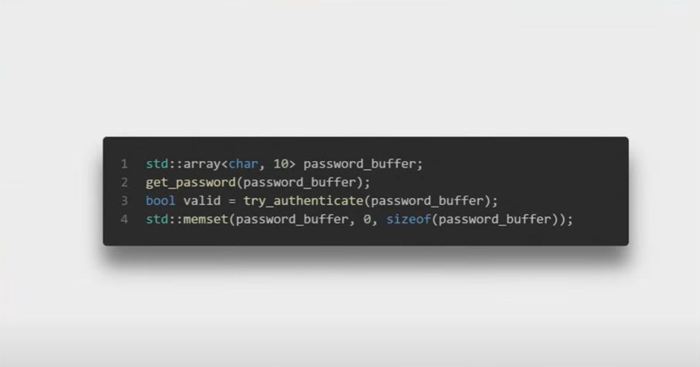
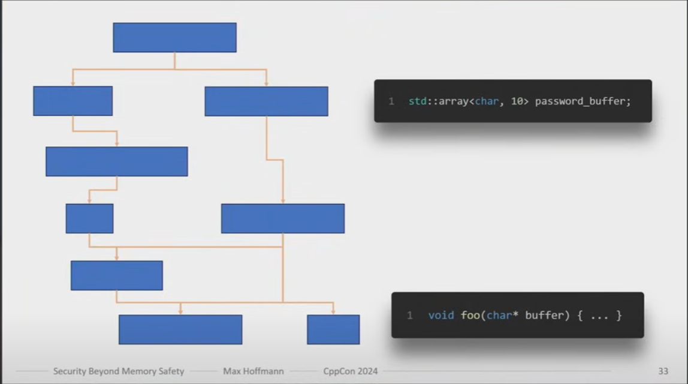
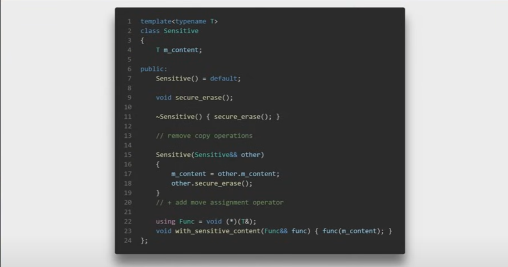
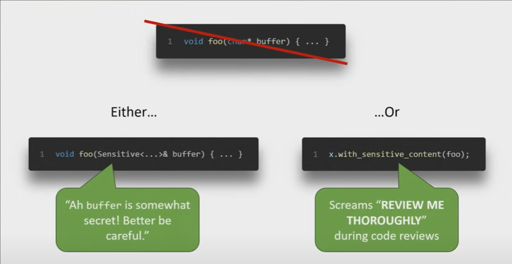
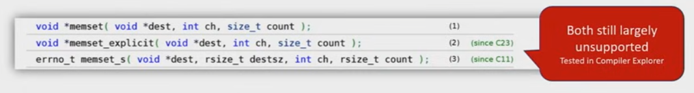

A common pitfall in code like this is **assuming that `memset` will reliably clear sensitive data (the password) from memory**. In optimized builds, compilers can see that `password_buffer` is never used again after the `memset` call and may legally **optimize that call away**, leaving the password bytes intact in memory.

### Why does the compiler optimize it away?
From the compiler’s perspective, once the password is no longer needed, zeroing it out has *no observable effect* on the program’s outcome. The C++ standard permits removal of “dead stores,” and a `memset` on data that will not be read again can be treated as a dead store. As a result, in a release (optimized) build, you might end up with the password bytes still present in memory, creating a security risk.

### Other potential issues
1. **Buffer overflow risk**: If `get_password` does not enforce a maximum length of 9 characters plus a null terminator, it can write out of bounds.  
2. **String handling**: If the password is treated as a C-string but is not always null-terminated by `get_password`, functions that expect a null terminator could read into uninitialized memory.

### How to fix
- **Use a “secure” clearing function**: Many platforms provide functions specifically intended for clearing sensitive data (e.g. `memset_s`, `explicit_bzero`, or OS-specific secure-zero functions) that are *guaranteed not* to be optimized away.
- **Enforce input bounds**: Make sure `get_password` never writes more than 9 characters plus a `'\0'`.
- **Avoid long-lived password buffers**: If possible, process the password immediately and use more secure data handling practices (e.g., only store a hash of the password, or store it in memory that the compiler knows must not be optimized away).

In short, the **vulnerability** is that a plain `std::memset` is not guaranteed to wipe secrets from memory in optimized builds—**the password can remain in RAM**, which is a security problem if an attacker can inspect memory later.

--------------------------------------------------------------------

In C and C++, the `memset` function is used to fill (or “set”) a block of memory with a specific byte value. It is declared in the header `<cstring>` (or `<string.h>` in C). Its prototype is:

```cpp
void* memset(void* ptr, int value, size_t num);
```

### Parameters:
- **ptr**: Pointer to the memory block to fill.
- **value**: The byte value (converted to unsigned char) that will be used to fill the block of memory.
- **num**: The number of bytes to set to the specified value.

### Return value:
`memset` returns the original pointer (`ptr`) passed in, allowing for chained operations or direct usage of the pointer afterward.

### When to use `memset`?
- **Initializing arrays**: Quickly set all elements to 0 (or another known value).
- **Resetting structs**: Clear or fill all struct members with a particular byte.
- **Clearing buffers**: Before reusing memory buffers or to ensure sensitive data is removed.

### Important details:
- `memset` treats the memory region purely as bytes. It does not respect the type boundaries (e.g., `int`, `char`, or any other type). Therefore, it’s especially common with `char` arrays or when you need to set everything to zero in an `int` array. For non-zero initialization of integer arrays using `memset`, be careful—`memset(arr, 1, sizeof(arr))` sets each byte in `arr` to 1, **not** each integer element to 1.

---

## Example 1: Initialize a character array

```cpp
#include <iostream>
#include <cstring>  // For memset

int main() {
    const int SIZE = 10;
    char myArray[SIZE];

    // Set all 10 bytes to 'A'
    memset(myArray, 'A', SIZE);

    // Add a null terminator to print as a string
    myArray[SIZE - 1] = '\0';

    std::cout << "myArray: " << myArray << std::endl;
    return 0;
}
```

**Explanation**:
- We include `<cstring>` to use `memset`.
- We call `memset(myArray, 'A', SIZE)`, which fills all 10 bytes of `myArray` with the character `'A'`.
- We overwrite the last character with `'\0'` to safely print `myArray` as a C-string.

---

## Example 2: Zero out an integer array

```cpp
#include <iostream>
#include <cstring>  // For memset

int main() {
    const int SIZE = 5;
    int intArray[SIZE];

    // Fill the memory of intArray with zeros
    memset(intArray, 0, SIZE * sizeof(int));

    std::cout << "intArray after memset: ";
    for (int i = 0; i < SIZE; ++i) {
        std::cout << intArray[i] << " ";
    }
    std::cout << std::endl;

    return 0;
}
```

**Explanation**:
- We have an integer array of size 5.
- To zero it out, we use `memset(intArray, 0, SIZE * sizeof(int))`.
- Each byte is set to zero, effectively setting all integers to 0.

---

### Key takeaway
`memset` is a low-level function that sets a block of memory to a specific byte value. It’s often used for initialization or clearing memory buffers in both C and C++ code. Always keep in mind that it operates at the byte level, so understand the implications when using it on different data types.


--------------------------------------------------------------------





Below is a line-by-line breakdown of what this `Sensitive<T>` class is doing, why it exists, and what considerations go into writing such a class.

```cpp
template<typename T>
class Sensitive
{
    T m_content;
public:
    Sensitive() = default;
    void secure_erase();
    ~Sensitive() { secure_erase(); }

    // remove copy operations
    Sensitive(Sensitive&& other)
    {
        m_content = other.m_content;
        other.secure_erase();
    }
    // add move assignment operator

    using Func = void (*)(T&);
    void with_sensitive_content(Func&& func) { func(m_content); }
};
```

---

## 1. Purpose and Goals

- **Goal**: Safely encapsulate a piece of sensitive data (like a password, cryptographic key, or any secret) so that:
  1. **Copying** is either disallowed or minimized (to avoid leaving multiple copies of the secret in memory).
  2. **Destruction** reliably overwrites (erases) the secret so it’s less likely to remain in memory once you are done using it.

- **Key points**:
  - C++ compilers can optimize away trivial calls to `memset` or similar “erase” functions if they appear to have no side effects. A properly implemented `secure_erase()` should be recognized as having side effects that the compiler must not remove.
  - We want to ensure that the secret is erased both in the destructor and (optionally) when the object is moved from.

---

## 2. Member variables

```cpp
T m_content;
```
- `m_content` stores the actual sensitive data.  
- `T` might be a type like `std::string`, a fixed-size array, or any other container that holds the secret.

---

## 3. Construction and destruction

```cpp
Sensitive() = default;
void secure_erase();
~Sensitive() { secure_erase(); }
```
1. **Default constructor** – Just sets up an empty `Sensitive<T>` object, presumably with `m_content` in its default state.  
2. **`secure_erase()`** – Intended to securely overwrite the memory of `m_content`. (This function’s implementation typically uses special OS or library functions that won’t be optimized away, e.g., `memset_s` or `explicit_bzero`, or inline assembly to ensure the compiler can’t remove it.)  
3. **Destructor** – Calls `secure_erase()` so that when the object goes out of scope, the sensitive data is wiped from memory.

---

## 4. Deleting or restricting copy operations

The comment says:
```cpp
// remove copy operations
```
Typically, you would do something like:
```cpp
Sensitive(const Sensitive&) = delete;
Sensitive& operator=(const Sensitive&) = delete;
```
- This makes it impossible to accidentally copy the sensitive data, thus avoiding having multiple copies in memory.  
- If a user tries to do `Sensitive<T> x = y;`, the code won’t compile.

---

## 5. Move operations

```cpp
Sensitive(Sensitive&& other)
{
    m_content = other.m_content;
    other.secure_erase();
}
```
- **Move constructor**: Transfers the content from `other` into the new object, then immediately calls `other.secure_erase()` so that the moved-from object no longer holds any valid sensitive data.  
- You would also typically provide a **move assignment operator**:
  ```cpp
  Sensitive& operator=(Sensitive&& other)
  {
      // If we already have content, secure_erase() it first
      secure_erase();
      m_content = std::move(other.m_content);
      other.secure_erase();
      return *this;
  }
  ```
- The rationale: you want to ensure that any time you move a `Sensitive<T>`, the old location is wiped out so no stale data remains in memory.

---

## 6. `with_sensitive_content` method

```cpp
using Func = void (*)(T&);
void with_sensitive_content(Func&& func) { func(m_content); }
```
- This is a small utility that gives you a controlled way to *use* the sensitive data without returning it by reference or pointer.  
- You pass in a function (or function object) that takes a `T&`, and the `Sensitive` class will call that function on `m_content`.  
  - Example usage:
    ```cpp
    Sensitive<std::string> password{...};
    password.with_sensitive_content([](std::string& pw) {
        // do something with the password
        // e.g., check length, pass to encryption routine, etc.
    });
    ```
- By providing this method, you can do ephemeral operations on the secret while still keeping it encapsulated. You avoid making copies, returning raw pointers, or otherwise letting the data escape the “secure” wrapper.  
- You might also see a variation that returns the result of the function, e.g.:
  ```cpp
  template <typename R>
  R with_sensitive_content(std::function<R(T&)>&& func) {
      return func(m_content);
  }
  ```
  so that computations on the secret can return some result (like a bool for “is password valid?”) but never expose the secret itself.

---

## 7. Caveats and Challenges

1. **Compiler Optimizations**: You must ensure `secure_erase()` is actually called and not optimized out. This often requires using OS- or compiler-specific primitives (like `memset_s`, `explicit_bzero`, or volatile operations).  
2. **Copying `T` Internals**: Even though you disallow copying at the `Sensitive<T>` level, if `T` is a standard container (like `std::string`), internally it might allocate on the heap. The standard string implementation can copy data behind the scenes. It might create temporary copies when resizing or appending. So, you need to ensure that the type `T` itself is safe for sensitive data use.  
3. **Move Semantics**: By allowing a move, the data *does* still exist in memory for a brief moment before you erase it from `other`. For many applications, that is acceptable. But if your threat model says “the moment a secret is in memory it’s at risk,” you might have deeper constraints.  
4. **Lifetime**: If a `Sensitive<T>` is destroyed but you have *other* pointers or references into `m_content`, those can be used after destruction—leading to undefined behavior and possible leaks.  
5. **Side Channels**: Even if you reliably erase memory, the data might have leaked into logs, swap, backups, or console output. A secure class approach is only one part of a more extensive chain of security best practices.

---

### Summary

- **`Sensitive<T>`** is a utility class for storing and managing **sensitive data** with the goal of preventing unintended copying and ensuring secure erasure on destruction.  
- It **disables** copy semantics, **implements** move semantics that erases the old object’s data, and **provides** a function (`with_sensitive_content`) to safely operate on the contained data without exposing it.  
- A proper **`secure_erase()`** must be carefully implemented to avoid being optimized away.  
- This pattern, while helpful, is **not** a silver bullet. It is part of a broader secure-coding strategy that includes using the right low-level functions, controlling data flow, and avoiding other channels that could leak secret data.

-----------------------------------------------------------------



In modern C (and C++), three functions are commonly discussed for clearing memory:

1. **`memset` (classical)**  
2. **`memset_explicit` (new in C23)**  
3. **`memset_s` (from the optional C11 bounds-checking interface)**  

Below is an explanation of how they differ, why they exist, and practical usage considerations—followed by short code examples.

---

## 1. `memset`

```c
void *memset(void *dest, int ch, size_t count);
```
- **Availability**: Part of the traditional C standard library (`<string.h>`).
- **Behavior**: Fills the first `count` bytes of memory at `dest` with the byte value `ch`.
- **Compiler Optimization Issue**: When using `memset` to clear sensitive data (like passwords or encryption keys), compilers sometimes optimize the call away if they detect that `dest` is not used afterward. This can leave sensitive data in memory, creating a security risk.  

### Example of potential problem

```cpp
#include <cstring>

void erase_password(char* password, size_t size) {
    // The compiler *might* remove this in an optimized build
    // if it decides the buffer is not accessed again.
    memset(password, 0, size); 
}
```

If the compiler sees no further reads from `password` after `memset`, it may skip the zero-fill.  

---

## 2. `memset_explicit` (C23)

```c
void *memset_explicit(void *dest, int ch, size_t count);
```
- **Availability**: Introduced in **C23**; still “largely unsupported” in current compilers (as of early 2025) because many toolchains have not yet fully implemented C23 libraries.
- **Goal**: Guaranteed by the C23 standard *not* to be optimized away. This solves the security problem of compilers removing a call to clear memory.
- **Signature**: Identical parameter list to `memset`, but it promises a “side effect” that the compiler must honor.

### Example usage (once supported)

```c
#include <string.h> // or possibly <cstring> in C++

void secure_erase(void *buffer, size_t size) {
    // This call should not be optimized out in C23-compliant implementations
    memset_explicit(buffer, 0, size);
}
```
When compilers and standard libraries fully adopt C23, `memset_explicit` will be the direct replacement for clearing sensitive data safely, without fear of the call being optimized away.

---

## 3. `memset_s` (C11 Annex K)

```c
errno_t memset_s(void *dest, rsize_t destsz, int ch, rsize_t count);
```
- **Availability**: Proposed in **C11** *Annex K*, but **Annex K** is optional. Many library implementations (including glibc on Linux) do **not** provide it, or do so only partially. Windows provides a version under its “secure CRT.”
- **Extra parameters**:  
  - `destsz` is the total size of the `dest` buffer.  
  - `count` is how many bytes you actually want to set.  
- **Behavior**:  
  - If `count` exceeds `destsz`, an error (`EINVAL`) is returned, and the function *still* zeroes the whole buffer to avoid partial overwrites.
  - Supposedly *guaranteed* not to be optimized out by conforming compilers, since it has defined side effects under Annex K.
- **Practical challenge**: Because Annex K is not universally implemented, using `memset_s` can be non-portable.  

### Example usage (on a system that supports Annex K)

```c
#include <string.h>  // or <corecrt_memset_s.h> on some MSVC setups
#include <stdio.h>

void secure_erase(void *buffer, size_t buffer_size) {
    // Use the Annex K function if available:
    if (memset_s(buffer, buffer_size, 0, buffer_size) != 0) {
        // Handle error (e.g., log or abort)
        fprintf(stderr, "memset_s failed!\n");
    }
}
```

---

## Which One Should You Use?

1. **`memset_explicit`**:  
   - The ideal choice if/when your compiler and standard library support **C23**.  
   - Guaranteed not to be optimized away.
   - Same parameters and usage pattern as `memset`.

2. **`memset_s`**:  
   - Potentially good for codebases that have a C11 Annex K–compatible library (e.g., on certain Windows toolchains).  
   - Has extra safety checks for buffer size but can be **non-portable**.

3. **`memset`**:  
   - Fully portable but **not** guaranteed to prevent compiler optimizations that remove the call.  
   - If you rely on `memset`, you might need compiler-specific tricks (like using `volatile` pointers or inline assembly) or other library functions (`explicit_bzero`, on some BSDs and Linux distributions) to force the compiler to actually perform the operation.

---

## Portable Workarounds

- **`explicit_bzero`** (POSIX/BSD extension): Similar to `memset_explicit`; widely used on some Unix-like systems. Not part of the C standard, but often available on Linux, FreeBSD, OpenBSD, etc.
- **Compiler-specific intrinsics or pragmas**:  
  - MSVC has `_secure_zero_memory`.  
  - GCC/Clang let you use `__asm__ __volatile__("" : : : "memory")` barriers, or link-time flags that prevent removal of certain calls.
- **Write your own “secure erase”** in assembly or `volatile` writes. This is more error-prone, but can be a fallback when none of the above are available.

---

### Example of a “custom secure erase” approach

```cpp
inline void secure_erase_custom(void* v, size_t n) {
    volatile unsigned char* p = (volatile unsigned char*)v;
    while (n--) {
        *p++ = 0;
    }
}
```

- By writing through a **volatile** pointer, many compilers will refrain from optimizing it away (although this is not explicitly guaranteed by the C standard).  
- This is a *common practice* for cryptographic libraries that need a fallback when no system-provided secure wipe function is available.

---

## Conclusion

- **`memset`** is widely supported but not secure for wiping secrets in all build configurations.  
- **`memset_explicit`** (C23) and **`memset_s`** (Annex K) attempt to fix this shortcoming, but **real-world support** is still limited.  
- Until compilers and standard libraries catch up, you may need **platform-specific** functions like `explicit_bzero` or a **custom** volatile-based erase function to ensure sensitive data is truly overwritten.
